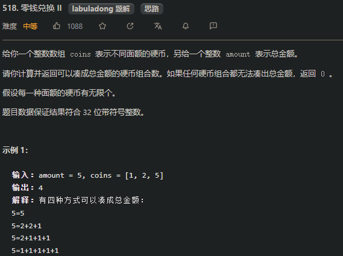
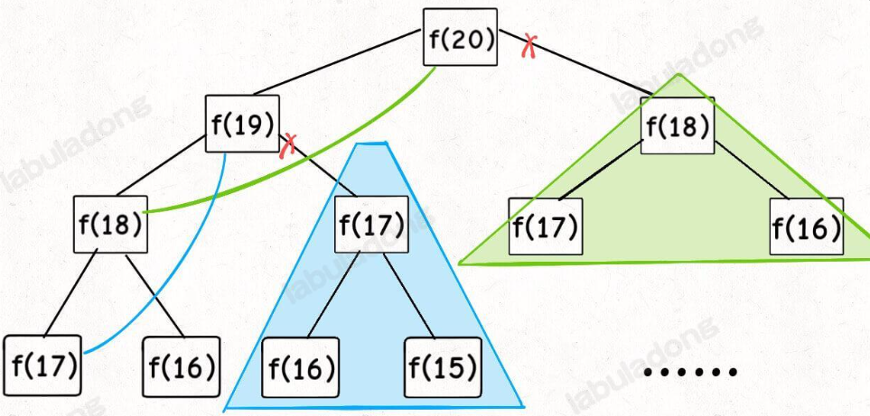

#   动态规划题目总结

---

## 1.动态规划介绍

​	动态规划，简称DP算法，如果某一问题有很多重叠子问题，使用DP来求解是最有效的

​	由于存在许多子问题，所有动态规划的每一个状态都是从上一个状态推导出来的，这与贪心算法的区别很大，贪心算法没有状态推导，是由局部最优推出全局最优。


## 2.动态规划解题步骤

​	==动态规划五部曲==

> 1. 确定dp数组以及下标的含义

> 2. 确定递推公式

> 3. dp数组如何初始化

> 4. 确定遍历顺序

> 5. 举例推导dp数组

- 那么问题来了，**为何数组的初始化在确定递推公式之后？**

> 因为有些情况是递推公式决定dp数组如何初始化。动态规划五部曲每一步都很重要，解题时，每一步都需要思考清楚。

- 动态规划的代码很容易出现问题，所有求解时最好将dp数组打印出来，从而验证自己的思路是否正确。

- Carl哥教诲

  > **做动规的题目，写代码之前一定要把状态转移在dp数组的上具体情况模拟一遍，心中有数，确定最后推出的是想要的结果**。
  >
  > 然后再写代码，如果代码没通过就打印dp数组，看看是不是和自己预先推导的哪里不一样。
  >
  > 如果打印出来和自己预先模拟推导是一样的，那么就是自己的递归公式、初始化或者遍历顺序有问题了。
  >
  > 如果和自己预先模拟推导的不一样，那么就是代码实现细节有问题。
  >
  > **这样才是一个完整的思考过程，而不是一旦代码出问题，就毫无头绪的东改改西改改，最后过不了，或者说是稀里糊涂的过了**。


## 3.爬楼梯

> 题目：假设你正在爬楼梯。需要 n 阶你才能到达楼顶。每次你可以爬 1 或 2 个台阶。你有多少种不同的方法可以爬到楼顶呢？注意：给定 n 是一个正整数。
>
> 示例 1：
>
> - 输入： 2
> - 输出： 2
> - 解释： 有两种方法可以爬到楼顶。
>   - 1 阶 + 1 阶
>   - 2 阶
>
> 示例 2：
>
> - 输入： 3
> - 输出： 3
> - 解释： 有三种方法可以爬到楼顶。
>   - 1 阶 + 2 阶
>   - 1 阶 + 1 阶 + 1 阶
>   - 2 阶 + 1 阶

- 思路分析：爬到第一层楼梯有一种方法，爬到二层楼梯有两种方法。那么第一层楼梯再跨两步就到第三层 ，第二层楼梯再跨一步就到第三层。
  推广到：爬第 i 层时，可以有第 i-1 层跨一步上来，也可以由第 i-2 层跨两步上来，所有 **dp[i] = dp[i-1] + dp[i-2]**

- 动态规划五部曲：

  > 1. 确定dp数组以及下标的含义
  >    dp[i]:爬到第i层楼梯，有dp[i]种方法
  > 2. 确定递推公式
  >    从dp[i]的定义可以看出，dp[i] 可以有两个方向推出来。
  >    首先是dp[i - 1]，上i-1层楼梯，有dp[i - 1]种方法，那么再一步跳一个台阶不就是dp[i]了么。
  >    还有就是dp[i - 2]，上i-2层楼梯，有dp[i - 2]种方法，那么再一步跳两个台阶不就是dp[i]了么。
  >    那么dp[i]就是 dp[i - 1]与dp[i - 2]之和！
  >    所以dp[i] = dp[i - 1] + dp[i - 2] 。
  >    在推导dp[i]的时候，一定要时刻想着dp[i]的定义，否则容易跑偏。
  > 3. dp数组初始化
  >    n >= 1
  >    爬第一层有一种方式，dp[1] = 1
  >    爬第二层有两种方式，dp[2] = 2
  > 4. 确定遍历顺序
  >    从递推公式dp[i] = dp[i - 1] + dp[i - 2];中可以看出，遍历顺序一定是从前向后遍历的
  > 5. 举例推导dp数组
  >    n=5时，dp = [1,2,3,5,8]

  

```java
public int climbStairs(int n) {
    if(n <= 2) return n;
    //由于dp数组的状态只与前两个值有关，则可以使用三个int型变量来优化空间
    int dp1 = 1;
    int dp2 = 2;
    int sum = 0;
    for(int i=3; i<=n; i++){
        sum = dp1+dp2;
        dp1 = dp2;//记录下一轮dp[i-2]
        dp2 = sum;//记录下一轮dp[i-1]
    }
    return dp2;
}
```


## 4.使用最小花费爬楼梯

> 给你一个整数数组 cost ，其中 cost[i] 是从楼梯第 i 个台阶向上爬需要支付的费用。一旦你支付此费用，即可选择向上爬一个或者两个台阶。
>
> 你可以选择从下标为 0 或下标为 1 的台阶开始爬楼梯。
>
> 请你计算并返回达到楼梯顶部的最低花费。
>
> 示例 1：
>
> 输入：cost = [10,15,20]
> 输出：15
> 解释：你将从下标为 1 的台阶开始。
> - 支付 15 ，向上爬两个台阶，到达楼梯顶部。
> 总花费为 15 。
> 示例 2：
>
> 输入：cost = [1,100,1,1,1,100,1,1,100,1]
> 输出：6
> 解释：你将从下标为 0 的台阶开始。
> - 支付 1 ，向上爬两个台阶，到达下标为 2 的台阶。
> - 支付 1 ，向上爬两个台阶，到达下标为 4 的台阶。
> - 支付 1 ，向上爬两个台阶，到达下标为 6 的台阶。
> - 支付 1 ，向上爬一个台阶，到达下标为 7 的台阶。
> - 支付 1 ，向上爬两个台阶，到达下标为 9 的台阶。
> - 支付 1 ，向上爬一个台阶，到达楼梯顶部。
> 总花费为 6 。
>
>
> 提示：
>
> 2 <= cost.length <= 1000
> 0 <= cost[i] <= 999

- 动态规划五部曲：

  > 1. 确定dp数组以及下标的含义
  >     dp[i]的定义：到达第i个台阶所花费的最少体力为dp[i]。
  > 2. 确定递推公式
  >     每次可以爬一层或两层，则第i层可以由第i-1层爬一步上来，也可以由第i-2层爬上来,再考虑爬第i层需要的体力成本cost[i]
  >     即爬第i层最少的体力为：==dp[i] = min(dp[i-1], dp[i-2]) + cost[i]==
  > 3. dp数组初始化
  >     dp[0] = cost[0]
  >     dp[1] = cost[1]
  > 4. 确定遍历顺序
  >     从前往后
  > 5. 举例推导dp数组
  >     当cost = {1, 100, 1, 1, 1, 100, 1, 1, 100, 1}
  >     可推导出dp = {1,100,2,3,3,103,4,,5,104,6}
  >     由于需要爬上楼顶(也可认为楼顶的体力消耗为0)，而最后需要根据最后两个数据得出最后体力消耗
  >     res = min(104,6) + 0 = 6

```java
public int minCostClimbingStairs(int[] cost) {
    int dp0 = cost[0];
    int dp1 = cost[1];
    int temp = 0;
    for(int i=2;i<cost.length;i++){
        temp = Math.min(dp0,dp1)+cost[i];
        dp0 = dp1;
        dp1 = temp;
    }
    //for循环结束后，还没有达到楼顶，此时可用选择从dp0跨两个楼梯上楼顶 或者 dp1 跨一个楼梯上楼顶
    return Math.min(dp0,dp1);

}
```

## 5.不同路径(机器人走路)

> 题目：一个机器人位于一个 m x n 网格的左上角。机器人每次只能向下或者向右移动一步。机器人试图达到网格的右下角。
>
> 问总共有多少条不同的路径？

- 动态规划五部曲

  > 1. 确定dp数组以及下标的含义
  >         dp[i] [j]是到达(i,j)位置的所有路径数
  > 2. 确定递推公式
  >            除了第0行和第0列，每个位置都可由其上和其左边过来，则dp[i] [j] = dp[i-1] [j] + dp[i] [j-1] (其中 1<=i<m,1<=j<n)
  > 3. dp数组初始化
  >            除了[0,0],第0行的位置都只能由其左边位置过来，则dp[0] [1~n] = 1 
  >        
  >        ​	除了[0,0],第0列的位置都只能由其上边位置过来，则dp[1~m] [0] = 1
  > 5. 确定遍历顺序
  >            只能向右或向下，顺序无所谓
  > 6. 举例推导dp数组
  >            m=3,n=2时
  >            dp = [0,1]
  >                 [1,2]
  >                 [1,3]

```java
public static int uniquePaths(int m, int n) {
    int[][] dp = new int[m][n];
    for(int i=0;i<m;i++) dp[i][0] = 1;
    for(int i=0;i<n;i++) dp[0][i] = 1;
    //先向右遍历再向下遍历
    for(int i=1;i<m;i++){
        for(int j=1;j<n;j++){
            dp[i][j] = dp[i-1][j] + dp[i][j-1];
        }
    }
    return dp[m-1][n-1];
}

// 压缩数组
public int uniquePaths(int m, int n) {
    int[] dp = new int[n + 1];// 往格子最左边加一列，值全为0
    Arrays.fill(dp, 1);//最顶上的格子都只有一条路径，只能从其左边过来
    dp[0] = 0;
    for(int i = 1; i < m; i++){
        for(int j = 1; j <= n; j++){
            //dp[1] = 0 + 1 --- 最左边是我们事先加的一列，便于处理边界情况
            dp[j] = dp[j - 1] + dp[j];
        }
    }
    return dp[n];

}
```

## 6.不同路径II(机器人走路有障碍)

> 题目：在上一题的基础上加入限制条件：表格中存在障碍点，这些位置不能通过。障碍点的位置使用obstacleGrid)数组记录
>
> 本题动态规划五部曲与上一题类似，主要不同的地方在于dp数组初始化和递推公式
>
> - 初始化第0行时，由于该行的位置都只能从左边过来，只要遇到第一个障碍，后面的位置都无法到达
> - 初始化第0列时，由于该行的位置都只能从上边过来，只要遇到第一个障碍，下面的位置都无法到达
> - 递推公式也需要加入判断条件，如果该位置有障碍，则该位置无法到达
>   + if(obstacleGrid[i][j] != 1) dp[i] [j] = dp[i-1] [j] + dp[i] [j-1];
>
> 

```java
public int uniquePathsWithObstacles(int[][] obstacleGrid) {
    if(obstacleGrid[0][0] == 1) return 0;
    int m = obstacleGrid.length;
    int n = obstacleGrid[0].length;
    if(obstacleGrid[m-1][n-1] == 1) return 0;
    int[][] dp = new int[m][n];
    //初始化第0行时，由于该行的位置都只能从左边过来，只要遇到第一个障碍，后面的位置都无法到达
    for(int i = 0;i<n;i++){
        if(obstacleGrid[0][i] != 1) dp[0][i] = 1;
        else break;
    }
    //同理
    for(int i=1;i<m;i++){
        if(obstacleGrid[i][0] != 1) dp[i][0] = 1;
        else break;
    }

    //更新位置时，遇到有障碍，则到达该位置的路径为0
    for(int i=1; i<m; i++){
        for(int j=1; j<n; j++){
            if(obstacleGrid[i][j] != 1) dp[i][j] = dp[i-1][j] + dp[i][j-1];
        }
    }

    return dp[m-1][n-1];
}
```

## 7.整数划分(难)

> 给定一个正整数 n，将其拆分为至少两个正整数的和，并使这些整数的乘积最大化。 返回你可以获得的最大乘积。
>
> 示例 1:
>
> - 输入: 2
> - 输出: 1
> - 解释: 2 = 1 + 1, 1 × 1 = 1。
>
> 示例 2:
>
> - 输入: 10
> - 输出: 36
> - 解释: 10 = 3 + 3 + 4, 3 × 3 × 4 = 36。
> - 说明: 你可以假设 n 不小于 2 且不大于 58。

- 动态规划五部曲

  > 1. 确定dp数组以及下标的含义
  >            dp[i]：分拆数字i，可以得到的最大乘积为dp[i]。
  > 2. 确定递推公式
  >            创建数组dp，其中 dp[i] 表示将正整数 i 拆分成至少两个正整数的和之后，这些正整数的最大乘积。特别地，0 不是正整数，1 是最小的正整数，0 和 1 都不能拆分，因此 dp[0]=dp[1]=0。
  >            当 i ≥2 时，假设对正整数 i 拆分出的第一个正整数是 j（1≤j<i），则有以下两种方案：
  >            将 i 拆分成 j 和 i−j 的和，且 i−j 不再拆分成多个正整数，此时的乘积是 j×(i−j)；
  >            将 i 拆分成 j 和 i−j 的和，且 i−j 继续拆分成多个正整数，此时的乘积是 j×dp[i−j]。
  >            因此，当 j 固定时，有 ==dp[i]=max(j×(i−j),j×dp[i−j])==。由于 j 的取值范围是 1 到 i−1，需要遍历所有的 j 得到 dp[i] 的最大值，
  > 3. dp数组初始化
  >            由于0和1不能拆分，所以只初始化dp[2] = 1;
  > 4. 确定遍历顺序
  >            dp[i] 是依靠 dp[i - j]的状态，所以遍历i一定是从前向后遍历，先有dp[i - j]再有dp[i]。
  > 5. 举例推导dp数组
  >            n = 4
  >            dp[2] = 1,dp[3]=max(1 * 2,1 * dp[2]) = max(2,1) = 2
  >            dp[4] = max(1 * 3,1 * dp[3],2 * 2,2 * dp[2],3 * 1) = 4

```java
public int integerBreak(int n) {
    int[] dp = new int[n+1];
    dp[2] = 1;
    for(int i=3; i<=n; i++){//i为需要拆分的数
        for(int j = 1; j<i-1; j++){//将i差为j和i-j（i-j也可以选择继续拆分）
            dp[i] = Math.max(dp[i],Math.max(j*(i-j),j*dp[i-j]));
        }
    }
    return dp[n];

}
```

## 8.不同的二叉搜索树(好难)

>题目：给定一个整数 n，求以 1 ... n 为节点组成的二叉搜索树有多少种？
>
>
>
>

- 思路分析：

> 观察n=3的几种情况：
>
> - 当1为头结点的时候，其右子树有两个节点，这两个节点的布局，与 n 为2的时候两棵树的布局是一样的
> - 当2为头结点的时候，其左右子树都只有一个节点，布局与n为1的时候只有一棵树的布局也是一样的
> - 当3为头结点的时候，其左子树有两个节点，这两个节点的布局，与n为2的时候两棵树的布局也是一样的
>
> 发现到这里，其实我们就找到了重叠子问题了，其实也就是发现可以通过dp[1] 和 dp[2] 来推导出来dp[3]的某种方式。
>
> dp[3]，就是 ==元素1为头结点搜索树的数量 + 元素2为头结点搜索树的数量 + 元素3为头结点搜索树的数量==
>
> - 元素1为头结点搜索树的数量 = 左子树有0个元素的搜索树数量 * 右子树有2个元素的搜索树数量
>
> - 元素2为头结点搜索树的数量 = 左子树有1个元素的搜索树数量 * 右子树有1个元素的搜索树数量
>
> - 元素3为头结点搜索树的数量 = 左子树有2个元素的搜索树数量 * 右子树有0个元素的搜索树数量
>
> 有2个元素的搜索树数量就是dp[2]。
>
> 有1个元素的搜索树数量就是dp[1]。
>
> 有0个元素的搜索树数量就是dp[0]。
>
> 所以dp[3] = dp[2] * dp[0] + dp[1] * dp[1] + dp[0] * dp[2]
>
> 

- 动态规划五部曲

  >
  >
  >1. 确定dp数组以及下标的含义
  >        dp[i]：有 i 个结点的二叉搜索树的个数
  >2. 确定递推公式
  >    dp[i] += dp[以j为头结点左子树节点数量] * dp[以j为头结点右子树节点数量]
  >    j相当于是头结点的元素，从1遍历到i为止。
  >    所以递推公式：dp[i] += dp[j - 1] * dp[i - j]; ，j-1 为j为头结点左子树节点数量，i-j 为以j为头结点右子树节点数量
  >3. dp数组初始化
  >    初始化，只需要初始化dp[0]就可以了，推导的基础，都是dp[0]。
  >    那么dp[0]应该是多少呢？
  >    从定义上来讲，空节点也是一棵二叉树，也是一棵二叉搜索树，这是可以说得通的。
  >    从递归公式上来讲，dp[以j为头结点左子树节点数量] * dp[以j为头结点右子树节点数量] 中以j为头结点左子树节点数量为0，也需要dp[以j为头结点左子树节点数量] = 1， 否则乘法的结果就都变成0了。
  >    所以初始化dp[0] = 1
  >4. 确定遍历顺序
  >    首先一定是遍历节点数，从递归公式：dp[i] += dp[j - 1] * dp[i - j]可以看出，节点数为i的状态是依靠 i之前节点数的状态。
  >    那么遍历i里面每一个数作为头结点的状态，用j来遍历。
  >5. 举例推导dp数组

```java
public int numTrees(int n) {
    //初始化 dp 数组
    int[] dp = new int[n + 1];
    //初始化0个节点和1个节点的情况
    dp[0] = 1;//关键取值
    dp[1] = 1;
    for (int i = 2; i <= n; i++) {
        for (int j = 1; j <= i; j++) {
            //对于第i个节点，需要考虑1作为根节点直到i作为根节点的情况，所以需要累加
            //j的取值为作为当前根节点的值
            //一共i个节点，对于根节点j时,左子树的节点个数为j-1，右子树的节点个数为i-j
            dp[i] = dp[i]+ dp[j - 1] * dp[i - j];
        }
    }
    return dp[n];

}
```

## 9.==01背包问题(重点)==

>问题描述：有==n件物品==和一个最多能背==重量为w的背包==。第==i==件物品的==重量是weight[i]==，得到的==价值是value[i]== 。每件物品只能==用一次==，求解将哪些物品装入背包里物品价值总和最大。
>
>注意事项：二维和一维数组版本都是先遍历物品再遍历背包，但是遍历方向有区别
>
>- 二维数组先正序遍历物品，再正序遍历背包
>- 一维数组先正序遍历物品，但是再逆序遍历背包，因为从二维数组角度可以看出，除初始化的值之外，每个值都受其左上角的值的影响，逆序遍历物品可以保证左上角的值仍然是上一层的 ==层之间的元素互相之间没有影响，所有正序逆序对彼此没有影响==

- 动态规划五部曲

  - 二维数组版本

  > 1. 确定dp数组以及下标的含义
  >         dp[i] [j]表示从下标为[0-i]的物品里面任意取，放进容量为j的背包，价值总和最大为多少
  > 2. 确定递推公式
  >     dp[i] [j]主要从两个方向推出：
  >     *不放物品：由dp[i-1] [j]推出，即背包容量为j，里面不放物品i的最大价值，此时dp[i][j]就是dp[i - 1] [j]。
  >         (其实就是当物品i的重量大于背包j的重量时，物品i无法放进背包中，所以被背包内的价值依然和前面相同。)
  >     *放物品：由dp[i-1] [j-weight[i]]+value[i]推出，其中dp[i - 1] [j - weight[i]] 为背包容量为j - weight[i]的时候不放物品i的最大价值(此时加上weight[i]则重量为j)
  >     递推公式：dp[i] [j] = max(dp[i - 1] [j], dp[i - 1] [j - weight[i]] + value[i]);
  > 3. dp数组初始化
  >     首先从dp[i] [j]的定义出发，如果背包容量j为0的话，即dp[i] [0]，无论是选取哪些物品，背包价值总和一定为0。
  >     其次，由状态转移方程 dp[i][j] = max(dp[i - 1] [j], dp[i - 1] [j - weight[i]] + value[i]); 可以看出i 是由 i-1 推导出来，那么i为0的时候就一定要初始化。
  >     dp[0] [j]，即：i为0，存放编号0的物品的时候，各个容量的背包所能存放的最大价值。
  >     那么很明显当 j < weight[0]的时候，dp[0] [j] 应该是 0，因为背包容量比编号0的物品重量还小。
  >     当j >= weight[0]时，dp[0] [j] 应该是value[0]，因为背包容量放足够放编号0物品。
  > 4. 确定遍历顺序
  >     主要有两个遍历的维度：物品和背包容量。先遍历物品更好理解
  > 5. 举例推导dp数组
  >     重量     0 1  2  3  4
  >     物品0    0 15 15 15 15
  >     物品1    0 15 15 20 35
  >     物品2    0 15 15 20 35	

  

```java
public static void testweightbagproblem(int[] weight, int[] value, int bagsize) {
    int wLen = weight.length;
    int value0 = 0;
    //定义dp数组:dp[i][j]表示背包容量为j时，前i个物品能获得的最大价值
    int[][] dp = new int[wLen][bagsize + 1];

    //遍历顺序：先遍历物品，在遍历背包容量
    for (int i = 1; i < wLen; i++) {//遍历物品
        for (int j = 1; j <= bagsize; j++) {//遍历背包容量
            if (j < weight[i]) dp[i][j] = dp[i - 1][j];//当前背包容量小于当前物品重量，则无法装入
            else dp[i][j] = Math.max(dp[i-1][j], dp[i - 1][j - weight[i]] + value[i]);
        }
    }   
    
    //dp[wLen][bagsize]的值即为能获得的最大价值

}
```

- 一维数组版本

  > 1. 确定dp数组以及下标的含义
  >         在一维dp数组中，dp[j]表示：容量为j的背包，所背的物品价值可以最大为dp[j]。
  > 2. 确定递推公式
  >     dp[j]可以通过dp[j - weight[i]]推导出来，dp[j - weight[i]]表示容量为j - weight[i]的背包所背的最大价值。
  >     dp[j - weight[i]] + value[i] 表示 容量为 j - 物品i重量 的背包 加上 物品i的价值。（也就是容量为j的背包，放入物品i了之后的价值即：dp[j]）
  >     此时dp[j]有两个选择，一个是取自己dp[j] 相当于 二维dp数组中的dp[i-1] [j]，即不放物品i，一个是取dp[j - weight[i]] + value[i]，即放物品i，指定是取最大的，毕竟是求最大价值，
  >     即：dp[j] = max(dp[j], dp[j - weight[i]] + value[i]);
  > 3. dp数组初始化
  >     由递归公式：dp[j] = max(dp[j], dp[j - weight[i]] + value[i]);
  >     dp数组在推导的时候一定是取价值最大的数，如果题目给的价值都是正整数那么非0下标都初始化为0就可以了。
  >     这样才能让dp数组在递归公式的过程中取的最大的价值，而不是被初始值覆盖了。
  >     那么假设物品价值都是大于0的，所以dp数组初始化的时候，都初始为0就可以了
  > 4. 确定遍历顺序
  >     一维dp数组与二维dp数组遍历顺序不一样
  >     二维dp遍历的时候，背包容量是从小到大，而一维dp遍历的时候，背包是从大到小(即倒序)。
  >     因为一维dp的dp[i]的值需要用到dp[i-1],如果正序遍历的话dp[i]会用到dp[i-1]变化之后的值
  >     倒序遍历的原因是，本质上还是一个对二维数组的遍历，并且右下角的值依赖上一层左上角的值，因此需要保证左边的值仍然是上一层的，从右向左覆盖。
  >     即：先遍历物品，再倒序遍历背包容量
  > 5. 举例推导dp数组
  >     用物品0遍历时    0 15 15 15 15
  >     用物品1遍历时    0 15 15 20 35
  >     用物品2遍历时    0 15 15 20 35

```java
public static void testweightbagproblem1(int[] weight, int[] value, int bagsize){
    int wLen = weight.length;
    int[] dp = new int[bagsize+1];//bag[j]
    for(int i=0; i<wLen; i++){
        for(int j=bagsize; j>=weight[i]; j--){//背包容量逆序遍历，截止到weight[i]
            dp[j] = Math.max(dp[j],dp[j-weight[i]]+value[i]);
            System.out.print(dp[j]+" ");
        }
        System.out.println();
    }
    
//dp[bagsize]即为背包能装的最大价值
 
}
```

## 10.分割等和子集

> 题目：给定一个只包含正整数的非空数组。是否可以将这个数组分割成两个子集，使得两个子集的元素和相等。
>
> 注意: 每个数组中的元素不会超过 100 数组的大小不会超过 200
>
> 示例 1: 输入: [1, 5, 11, 5] 输出: true 解释: 数组可以分割成 [1, 5, 5] 和 [11].
>
> 示例 2: 输入: [1, 2, 3, 5] 输出: false 解释: 数组不能分割成两个元素和相等的子集.
>

- 思路分析

  >本题可以转化为01背包问题。即从数组中找到一部分元素，这些元素的和为数组所有元素和的一半。

- 动态规划五部曲

  > 1. 确定dp数组以及下标的含义
  >         01背包中，dp[j]表示：容量为j的背包，所背的子集最大和为dp[j]
  > 2. 确定递推公式
  >     dp[j] = Math.max(dp[j],dp[j-nums[i]]+nums[i]);
  > 3. dp数组初始化
  >     题目所给数组为正整数数组，则数组初始化为0即可
  > 4. 确定遍历顺序
  >     先正序遍历数组元素，再倒序遍历背包容量
  > 5. 举例推导dp数组
  >     输入：[1,5,11,5] sum = 11
  >     容量j 0 1 2 3 4 5 6 7 8 9 10 11
  >     dp   0 1 1 1 1 5 6 6 6 6 10 11

```java
// 二维版本
int sum = 0;
        for(int num : nums){
            sum += num;
        }
        if(sum % 2 == 1) return false;
        
        int n = nums.length;
        int m = sum / 2;
        int[][] dp = new int[n + 1][m + 1];
        for(int i = 1; i <= n; i++){
            for(int j = 1; j <= m; j++){
                if(j >= nums[i - 1]) dp[i][j] = Math.max(dp[i - 1][j], dp[i - 1][j - nums[i - 1]] + nums[i - 1]);
                else dp[i][j] = dp[i - 1][j];
            }
        }
        return dp[n][m] == m;

// 一维版本
public static boolean canPartition1(int[] nums) {
    int sum = 0;
    for(int i=0; i<nums.length; i++){
        sum += nums[i];
    }
    if(sum%2 == 1) return false;
    int target = sum/2;
    int[] dp = new int[target+1];


    for(int i=0;i<nums.length;i++){
        for(int j=target;j>=nums[i];j--){//j逆序直到nums[i]，小于nums[i]时装不进去
            dp[j] = Math.max(dp[j],dp[j-nums[i]]+nums[i]);

        }
    }

    if(dp[target] == target) return true;
    else return false;
}
```

## 11.最后一块石头的重量II

> 题目：有一堆石头，每块石头的重量都是正整数。
>
> 每一回合，从中选出任意两块石头，然后将它们一起粉碎。假设石头的重量分别为 x 和 y，且 x <= y。那么粉碎的可能结果如下：
>
> 如果 x == y，那么两块石头都会被完全粉碎； 如果 x != y，那么重量为 x 的石头将会完全粉碎，而重量为 y 的石头新重量为 y-x。 最后，最多只会剩下一块石头。返回此石头最小的可能重量。如果没有石头剩下，就返回 0。
>
> 示例： 输入：[2,7,4,1,8,1] 输出：1 解释： 组合 2 和 4，得到 2，所以数组转化为 [2,7,1,8,1]， 组合 7 和 8，得到 1，所以数组转化为 [2,1,1,1]， 组合 2 和 1，得到 1，所以数组转化为 [1,1,1]， 组合 1 和 1，得到 0，所以数组转化为 [1]，这就是最优值。

- 题目分析

  > 题目的本质就是==将所有石头分为两堆，然后求两堆石头的最小差值==。
  >         转化为01背包问题：==价格背包容量设为石头总量的一半，然后找到重量最大的的石头组合，当前得到的组合为最接近总量一半且较少的一堆，再用另外一堆减当前堆即可==

- 动态规划五部曲

  > 1. 确定dp数组以及下标的含义
  >         dp[j]表示容量（这里说容量更形象，其实就是重量）为j的背包，最多可以背dp[j]这么重的石头。
  > 2. 确定递推公式
  >     dp[j] = max(dp[j], dp[j - stones[i]] + stones[i]);
  > 3. dp数组初始化
  >     所有石头总量不为负数，初始化为0即可
  > 4. 确定遍历顺序
  >     先正序遍历石头，再逆序遍历背包容量
  > 5. 举例推导dp数组
  >          j     4 3 2 1
  >        s[0]  2 2 2 0
  >        s[0]  4 2 2 0
  >        s[0]  4 3 2 1
  >        s[0]  4 3 2 1

- 代码

  ```java
  //一维滚动数组版本，逆序遍历背包
  public static int lastStoneWeightII(int[] stones) {
      int sum = 0;
      for(int i=0;i<stones.length; i++){
          sum += stones[i];
      }
   
      int[] dp = new int[sum/2+1];
      for(int i=0; i<stones.length; i++){
          for (int j=sum/2; j>=stones[i]; j--){
              dp[j] = Math.max(dp[j],dp[j-stones[i]]+stones[i]);
              System.out.print(dp[j]+" ");
          }
          System.out.println();
      }
      return sum - 2*dp[dp.length-1];
  }
  ```

## 12.==目标和==(非常规01背包，本题使用回溯比较简单但是费时)

> 题目：给定一个非负整数数组，a1, a2, ..., an, 和一个目标数，S。现在你有两个符号 + 和 -。对于数组中的任意一个整数，你都可以从 + 或 -中选择一个符号添加在前面。
>
> 返回可以使最终数组和为目标数 S 的所有添加符号的方法数。关键：==返回所有解的个数==
>
> 示例：
>
> 输入：nums: [1, 1, 1, 1, 1], S: 3
> 输出：5
>
> 解释：
> -1+1+1+1+1 = 3
> +1-1+1+1+1 = 3
> +1+1-1+1+1 = 3
> +1+1+1-1+1 = 3
> +1+1+1+1-1 = 3
>
> 一共有5种方法让最终目标和为3。

- 思路分析

  > 部分带+号，部分带-号，最后求和。本质就是求数组中的一部分数 - 剩下的一部分 = target。
  >
  > 记：带 + 号的元素之和为left，带 - 号的元素之和为right。
  >
  > 则可得到：
  >
  > - left - right = target
  > - left + right = sum
  >
  > 即 left = (target + sum)/2
  >
  > 从而，题目转换为==找出元素和为**(target + sum)/2**的元素组合的个数==

- 动态规划五部曲

  > 1. 确定dp数组以及下标的含义
  >         dp[j]:组成==和为j的组合有dp[j]种方法==
  > 2. 确定递推公式
  >     不考虑nums[i]的情况下，填满容量为j的背包，有dp[j]种方法。
  >     那么考虑nums[i]的话（只要搞到nums[i]），凑成dp[j]就有dp[j - nums[i]] 种方法。
  >     例如：dp[j]，j 为5，
  >     已经有一个1（nums[i]） 的话，有 dp[4]种方法 凑成 dp[5]。
  >     已经有一个2（nums[i]） 的话，有 dp[3]种方法 凑成 dp[5]。
  >     已经有一个3（nums[i]） 的话，有 dp[2]中方法 凑成 dp[5]
  >     已经有一个4（nums[i]） 的话，有 dp[1]中方法 凑成 dp[5]
  >     已经有一个5（nums[i]）的话，有 dp[0]中方法 凑成 dp[5]
  >     即:dp[j] += dp[j-nums[i]] ---求组合问题都可用类似公式
  > 3. dp数组初始化
  >     由递推公式可知一切递推结果都与dp[0]有关
  >     而对于容量为0的背包，只有一种办法，即装0件物品
  >     即：dp[0] = 1
  > 4. 确定遍历顺序
  >     先正序遍历物品，再逆序遍历容量
  > 5. 举例推导dp数组
  >     对于nums = {1,1,1,1,1} target = 3
  >     left = (5+3)/2 = 4
  >             j        4 3  2  1 0
  >       nums[0]  0 0  0  1 1
  >       nums[1]  0 0  1  2 1
  >       nums[2]  0 1  3  3 1
  >       nums[3]  1 4  6  4 1
  >       nums[4]  5 10 10 5 1

- 代码

  ```java
  public static int findTargetSumWays(int[] nums, int target) {
      int sum = 0;
      for(int i=0; i<nums.length; i++){
          sum += nums[i];
      }
      if(Math.abs(target) > sum) return 0;
      if((sum + target)%2 == 1) return 0;
      int left = (sum + target)/2;
      int[] dp = new int[left+1];
      dp[0] = 1;//组成0的方法有一种
  
      for(int i=0; i<nums.length; i++){
          for(int j=left;j>=nums[i]; j--){
               //当背包容量为j时，dp[j-nums[i]]为考虑nums[i]时的方法数，旧dp[j]为不考虑当前nums[i]的方法数，新的dp[j]取二者和即可
               dp[j] = dp[j] + dp[j-nums[i]];
          }
      }
  
      return dp[left];
  
  }
  ```

## 13.一和零(多维背包的01背包问题，注意并不是多重背包)

> 题目描述：给你一个二进制字符串数组 strs 和两个整数 m 和 n 。
>
> 请你找出并返回 strs 的最大子集的大小，该子集中 最多 有 m 个 0 和 n 个 1 。
>
> 如果 x 的所有元素也是 y 的元素，集合 x 是集合 y 的 子集 。
>
> 示例 1：
>
> 输入：strs = ["10", "0001", "111001", "1", "0"], m = 5, n = 3 输出：4
>
> 解释：最多有 5 个 0 和 3 个 1 的最大子集是 {"10","0001","1","0"} ，因此答案是 4 。 其他满足题意但较小的子集包括 {"0001","1"} 和 {"10","1","0"} 。{"111001"} 不满足题意，因为它含 4 个 1 ，大于 n 的值 3 。
>
> 示例 2： 输入：strs = ["10", "0", "1"], m = 1, n = 1 输出：2 解释：最大的子集是 {"0", "1"} ，所以答案是 2 。

- 思考分析

> 回想一下01背包的递推公式：dp[j] = max(dp[j], dp[j - weight[i]] + value[i]);
> 对比一下就会发现，字符串的zeroNum和oneNum相当于物品的重量（weight[i]），字符串本身的个数相当于物品的价值（value[i]）。
> 即当前问题就是一个典型的01背包！ 只不过物品的重量有了两个维度而已。

- 动态规划五部曲

  > 1. 确定dp数组以及下标的含义
  >         dp[jZero] [jOne]:最多有jZero个0和jOne个1的最大子集的大小为dp[jZero] [jOne]
  >     
  > 2. 确定递推公式
  >
  >     ​    dp[i] [j]不考虑当前str时，子集大小可以由前一个strs里的字符串推导出来。
  >     ​	dp[i] [j]考虑当前str，当前str有zeroNum个0，oneNum个1, 则子集大小为 dp[i - zeroNum] [j - oneNum] + 1。
  >     ​	然后我们在遍历的过程中，取dp[i] [j]的最大值。
  >     ​	所以递推公式：dp[i] [j] = max(dp[i] [j], dp[i - zeroNum] [j - oneNum] + 1);
  >
  >     ​	回想一下01背包的递推公式：dp[j] = max(dp[j], dp[j - weight[i]] + value[i]);
  >     ​	对比一下就会发现，字符串的zeroNum和oneNum相当于物品的重量（weight[i]），字符串本身的个数相当于物品的价值（value[i]）。
  >     ​	即当前问题就是一个典型的01背包！ 只不过物品的重量有了两个维度而已。
  >
  > 3. dp数组如何初始化
  >         每个字符串里面的0和1的个数都不为负数，则可以初始化为0，保证递推时dp数组不会被初始值覆盖即可。
  >
  > 4. 确定遍历顺序
  >        先遍历物品（字符串里面的字符），再遍历背包(即0的个数m和1的个数n)
  >
  > 5. 举例推导dp数组
  >        以输入：["10","0001","111001","1","0"]，m = 3，n = 3为例

- 代码

  ```java
  public static int findMaxForm(String[] strs, int m, int n) {
      int[][] dp = new int[m+1][n+1];
      //正序遍历物品
      for(String str : strs){
          //先计算出每个str的0和1的个数
          int zeroBNum = 0,oneNum = 0;
          for(int index = 0;index<str.length();index++){
              if(str.charAt(index) == '0') zeroBNum++;
              else oneNum++;
          }
  		//逆序遍历二维背包
          for(int jZero = m;jZero>=zeroBNum; jZero--){
              for(int jOne = n; jOne>=oneNum; jOne--){
                  dp[jZero][jOne] = Math.max(dp[jZero][jOne],dp[jZero-zeroBNum][jOne-oneNum]+1);
                  System.out.println();
              }
          }
      }
  
      return dp[m][n];
  }
  ```

## 14.==完全背包问题==

- 问题描述

  > 有N件物品和一个最多能背重量为W的背包。第i件物品的重量是weight[i]，得到的价值是value[i] 。**每件物品都有==无限个==**（也就是可以放入背包多次），求解将哪些物品装入背包里物品价值总和最大。
  >
  > 完全背包和01背包问题唯一不同的地方就是，每种物品有无限件。

- 特点

  > 完全背包与01背包的最大区别在于遍历顺序(一维滚动数组版本)上，01背包遍历背包是逆序遍历，从而保证每个物品只被添加一次。而完全背包因为每个可以添加无限次，则==遍历背包时为正序遍历==

```java
//首先在回顾一下01背包的核心代码
for(int i = 0; i < weight.length; i++) { // 遍历物品
    for(int j = bagWeight; j >= weight[i]; j--) { // 遍历背包容量
        dp[j] = Math.max(dp[j], dp[j - weight[i]] + value[i]);
    }
}

//我们知道01背包内嵌的循环是从大到小遍历(倒序遍历)，为了保证每个物品仅被添加一次。
//而完全背包的物品是可以添加多次的，所以要从小到大去遍历，即：

// 先遍历物品，再遍历背包
for(int i = 0; i < weight.length; i++) { // 遍历物品
    for(int j = weight[i]; j <= bagWeight ; j++) { // 遍历背包容量
        dp[j] = Math.max(dp[j], dp[j - weight[i]] + value[i]);

    }
}
```

- 疑惑的几个点

  1. 为什么正序遍历背包可以保证物品被添加多次

     > 根据递推公式dp[j] = dp[j] + dp[j - coins[i]]，每个dp[i]值的计算都是有两种状态相加，即不使用当前coin(即旧的dp[j]) + 使用当前coin(dp[j - coins[i]])
     >
     > 例如 coins = {1,2,5}  amount = 5 我们外层遍历coin(i=0开始)，内层遍历背包(j=coins[i]开始)
     >
     > 第一轮 i=0 coins[i]=1  dp[1] = 0+dp[0] = 1 dp[2] = 0+dp[1] = 1 dp[3]=dp[4]=dp[5]=1
     >
     > 第二轮 i=1 coins[i]=2 dp[2] = dp[2] (不考虑面值为2的硬币)+dp[0] (考虑面值为2的硬币，注意，此时添加了一次硬币2) = 2 dp[3] = dp[3]+dp[1] = 2 
     >
     > ​			dp[4] = dp[4] (不考虑面值为2的硬币) + dp[2] (考虑面值为2的硬币，但是此处的dp[2]的值已经考虑过一次硬币2，所以可以看出是多次添加同一硬币，即为完全背包) = 3

  

  2. 为什么外层遍历物品可以保证最后结果是组合(无序，即（1,1,2）与（2,1,1）属于一种解)

     > 通过外层遍历物品，内层遍历背包容量来计算dp[i]的值时，可以确保使用的硬币的顺序，即先把某一种面值使用完，下一轮循环时不会再使用，从而保证为组合结果
     >
     > 例如，coins = {1,2}计算dp[3]时，一定是先遍历面额为1的硬币，再遍历面额为2的硬币，只会出现以下的组合
     >
     > ​	3 = 1 + 1 + 1
     >
     > ​	3 = 1 + 2
     >
     > 遍历到2时，不会再去遍历1，所有不会出现(1,2)和(2,1)同时出现
     >
     > 

     

  3. 为什么外层遍历背包可以保证最后结果是排列(有序，即（1,1,2）与（2,1,1）属于不同解)

     > 正如**问题2**所分析的，如果外层遍历背包容量，则不能保证使用硬币的顺序，因为对于每个容量，都会遍历一次所有的面额
     >
     > 例如coins={1,2} amount = 4 计算dp[3]时，
     >
     > j=3
     >
     > ​	i=0,coins[0] =1      dp[3] = dp[3] (不考虑面值1) + dp[2] (考虑面值1)
     >
     > ​	i=1,coins[1] =2      dp[3] = dp[3] (不考虑面值2，但是考虑过面值1) + dp[1] (考虑面值2)
     >
     > j=4
     >
     > ​	i=0,coins[0] =1      dp[4] = dp[4] (不考虑面值1) + dp[3] (考虑面值1,注意，此时dp[3]的值在上一次遍历时已经考虑过面值2以及面值1，所有得到的结果为排列数，即1,1,2和2,1,1是会同时出现)
     >
     > ​	i=1,coins[1] =2      dp[4] = dp[4] (不考虑面值2) + dp[2] (考虑面值2)

     ```java
     for(int j=1; j<=target; j++){//外层遍历背包
             for(int i=0; i<nums.length; i++){//内层遍历物品
                 if(j>=nums[i])dp[j] = dp[j] + dp[j-nums[i]];
             }
         }
         
     ```

     

## 15.零钱兑换II(完全背包求==组合==---组合问题外物品内背包，即先把物品固定)

- 问题描述

  > 给定不同面额的硬币和一个总金额。写出函数来计算可以凑成总金额的硬币组合数。假设每一种面额的硬币有无限个。
  >
  > 示例 1:
  >
  > 输入: amount = 5, coins = [1, 2, 5] 输出: 4 解释: 有四种方式可以凑成总金额: 5=5 5=2+2+1 5=2+1+1+1 5=1+1+1+1+1
  >
  > 示例 2: 输入: amount = 3, coins = [2] 输出: 0 解释: 只用面额2的硬币不能凑成总金额3。
  >
  > 示例 3: 输入: amount = 10, coins = [10] 输出: 1

- 动态规划五部曲

  > 1. 确定dp数组以及下标的含义
  >         dp[j]:凑成金额为j的货币组合有dp[j]种
  > 2. 确定递推公式
  >     当前问题属于组合问题，则递推公式为
  >         dp[j] += dp[j-coins[i]]
  >
  > 3. dp数组初始化
  >     由递推公式可知后续所有值都与dp[0]有关
  >     而对于dp[0],组成金额为0的方法只有一种，即使用0个硬币
  >
  > 4. 确定遍历顺序
  >     一般的完全背包问题，先遍历物品还是先遍历背包都可以，因为对于求和来说，内部元素的顺序没有关系
  >     但是当前问题是求组合问题，对于组合问题，两个方案的内部元素相同时则只能算一种方案
  >     例如：先遍历背包，再遍历物品
  >     for (int j = 0; j <= amount; j++) { // 遍历背包容量
  >         for (int i = 0; i < coins.size(); i++) { // 遍历物品
  >             if (j - coins[i] >= 0) dp[j] += dp[j - coins[i]];
  >         }
  >     }
  >     背包容量的每一个值，都是经过 1 和 5 的计算，包含了{1, 5} 和 {5, 1}两种情况。
  >     此时dp[j]里算出来的就是排列数！
  >
  >     即：对于组合问题，先遍历物品，再遍历背包
  >     此外，对于完全背包，物品可以重复添加，所有遍历背包时使用正序遍历，即从小到大遍历
  >
  > 5. 举例推导dp数组
  >     输入: amount = 5, coins = [1, 2, 5]
  >        j        0  1  2  3  4  5
  >     coins[0]=1  1  1  1  1  1  1
  >     coins[1]=2  1  1  2  2  3  3
  >     coins[2]=5  1  1  2  2  3  4

- 代码

```java
public static int change(int amount, int[] coins) {
    int[] dp = new int[amount+1];
    //dp数组初始化
    dp[0] = 1;
    for(int i=0; i<coins.length; i++){//正序遍历物品
        for(int j=coins[i]; j<=amount; j++){//正序遍历背包
            dp[j] += dp[j-coins[i]];
            System.out.print(dp[j]+" ");
        }
        System.out.println();
    }

    return dp[amount];
}
```

## 16.组合问题IV(完全背包求排列---排列问题外背包内物品，即先把背包固定)

- 题目描述

> 给定一个由正整数组成且不存在重复数字的数组，找出和为给定目标正整数的组合的个数。
>
> 示例:
>
> nums = [1, 2, 3] target = 4
>
> 所有可能的组合为： (1, 1, 1, 1) (1, 1, 2) (1, 2, 1) (1, 3) (2, 1, 1) (2, 2) (3, 1)
>
> 请注意，顺序不同的序列被视作不同的组合。
>
> 因此输出为 7。

- 动态规划五部曲

  > 1. 确定dp数组以及下标的含义
  >         dp[j]:凑成目标正整数为i的排列个数为的dp[j]
  > 2. 确定递推公式
  >     dp[j]（考虑nums[i]）可以由 dp[j - nums[i]]（不考虑nums[i]） 推导出来。
  >     因为只要得到nums[i]，排列个数dp[j - nums[i]]，就是dp[j]的一部分
  > 3. dp数组初始化
  >     dp[0] = 1;
  > 4. 确定遍历顺序
  >     由于是完全背包问题，则需要正序遍历物品和正序遍历背包
  >     再加上是求排列问题
  >     则是先正序遍历背包，再正序遍历物品
  > 5. 举例推导dp数组
  >     j  nums[0]=1 nums[1]=2 nums[2]=3
  >     1     1         1         1
  >     2     1         2         2
  >     3     2         3         4
  >     4     4         6         7

- 代码

  ```java
  public static int combinationSum4(int[] nums, int target) {
      int[] dp = new int[target+1];
      dp[0] = 1;
      for(int j=1; j<=target; j++){//外层遍历背包
          for(int i=0; i<nums.length; i++){//内层遍历物品
              if(j>=nums[i])dp[j] = dp[j] + dp[j-nums[i]];
              System.out.print(dp[j]+" ");
          }
          System.out.println();
      }
  
      return dp[target];
  }
  ```

## 17.爬楼梯(转化为完全背包求排列问题)

- 题目分析

  > 爬楼梯每次爬一层或两层，爬到楼顶共有多少种方式
  >
  > 可转换成 有无限个1和2，组成j(楼高)有多少种方式

- 动态规划五部曲

  >1. 确定dp数组以及下标含义
  >        dp[j]:爬到j级台阶有多少种方式
  >2. 确定递推公式
  >    dp[j] = dp[j] + dp[j-i] //i取1和2
  >3. dp数组初始化
  >    既然递归公式是 dp[i] += dp[i - j]，那么dp[0] 一定为1，dp[0]是递归中一切数值的基础所在，如果dp[0]是0的话，其他数值都是0了。
  >4. 确定遍历顺序
  >    完全背包求排列问题
  >    先正序遍历背包，再正序遍历物品
  >5. 举例推导递推数组
  >    略

- 代码

  ```java
  public static int climbStairs(int n) {
      if(n <= 2) return n;
      int[] dp = new int[n+1];
      dp[0] = 1;
      for(int j=1; j<=n; j++){
          for(int i=1; i<=2; i++){
              if(j>=i) dp[j] += dp[j-i];
          }
      }
      return dp[n];
  }
  ```

## 18.零钱兑换(纯完全背包问题，找最优解---内外循环无所谓)

- 题目描述

  > 给定不同面额的硬币 coins 和一个总金额 amount。编写一个函数来计算可以凑成总金额所需的最少的硬币个数。如果没有任何一种硬币组合能组成总金额，返回 -1。
  >
  > 你可以认为每种硬币的数量是无限的。
  >
  > 示例 1： 输入：coins = [1, 2, 5], amount = 11 输出：3 解释：11 = 5 + 5 + 1
  >
  > 示例 2： 输入：coins = [2], amount = 3 输出：-1
  >
  > 示例 3： 输入：coins = [1], amount = 0 输出：0
  >
  > 示例 4： 输入：coins = [1], amount = 1 输出：1
  >
  > 示例 5： 输入：coins = [1], amount = 2 输出：2

- 动态规划五部曲

  > 1. 确定dp数组以及下标的含义
  >         dp[j]:凑足总额为j所需钱币的最少个数
  > 2. 确定递推公式
  >     得到dp[j]（考虑coins[i]），只有一个来源，dp[j - coins[i]]（没有考虑coins[i]）。
  >     凑足总额为j - coins[i]的最少个数为dp[j - coins[i]]，那么只需要加上一个钱币coins[i]即dp[j - coins[i]] + 1就是dp[j]（考虑coins[i]）
  >     所以dp[j] 要取所有 dp[j - coins[i]] + 1 中最小的。
  >     递推公式：dp[j] = min(dp[j - coins[i]] + 1, dp[j]);
  > 3. dp数组初始化
  >     为了保证递推过程中得到的结果不被初始值覆盖，则dp[j]必出初始化一个最大的数来保证每次更新数值时数据会正确变化
  >     此外，递推时初始数据会被dp[0]影响，则dp[0]初始化为0
  >     即
  >         Arrays.fill(dp,10001);//硬币最大值为10000，所以选取10001，也可选取Integer.MAX_VALUE
  >         dp[0] = 0;
  >  4. 确定遍历顺序
  >     本题为纯完全背包问题
  >     则先正序遍历物品，再正序遍历背包
  >  5. 举例推导dp数组
  >        j       1  2  3  4  5
  >     coins[0]=1  1  2  3  4  5
  >     coins[1]=2      1  2  2  3
  >     coins[2]=5                  1

- 代码

```java
public static int coinChange(int[] coins, int amount) {
    int[] dp = new int[amount+1];
    Arrays.fill(dp,10001);
    dp[0] = 0;
    //本题外层遍历背包或物品都可以，因为只是求一组解，而不是求可行解的总数
    for(int i=0; i<coins.length; i++){
        for(int j=coins[i];j<=amount; j++){
            dp[j] = Math.min(dp[j],dp[j-coins[i]]+1);
        }
    }

    return dp[amount]==10001?-1:dp[amount];
}
```

## 19.完全平方数(纯完全背包问题，找最优解)

- 题目分析

  > 给定正整数 n，找到若干个完全平方数（比如 1, 4, 9, 16, ...）使得它们的和等于 n。你需要让组成和的完全平方数的个数最少。
  >
  > 给你一个整数 n ，返回和为 n 的完全平方数的 最少数量 。
  >
  > 完全平方数 是一个整数，其值等于另一个整数的平方；换句话说，其值等于一个整数自乘的积。例如，1、4、9 和 16 都是完全平方数，而 3 和 11 不是。
  >
  > 示例 1： 输入：n = 12 输出：3 解释：12 = 4 + 4 + 4
  >
  > 示例 2： 输入：n = 13 输出：2 解释：13 = 4 + 9
  >
  > 提示：
  >
  > 1 <= n <= 10^4

- 动态规划五部曲

  > 1. 确定dp数组以及下标含义
  >         dp[j]：和为j的完全平方数的最少数量为dp[j]
  > 2. 确定递推公式
  >     dp[j] 可以由dp[j - i * i]推出， dp[j - i * i] + 1 便可以凑成dp[j]。
  >     此时我们要选择最小的dp[j]，所以递推公式：dp[j] = min(dp[j - i * i] + 1, dp[j]);
  > 3. dp数组初始化
  >     dp[0]表示 和为0的完全平方数的最小数量，那么dp[0]一定是0。
  >     有同学问题，那0 * 0 也算是一种啊，为啥dp[0] 就是 0呢？
  >     看题目描述，找到若干个完全平方数（比如 1, 4, 9, 16, ...），题目描述中可没说要从0开始，dp[0]=0完全是为了递推公式。
  >     非0下标的dp[j]应该是多少呢？
  >     从递归公式dp[j] = min(dp[j - i * i] + 1, dp[j]);中可以看出每次dp[j]都要选最小的，所以非0下标的dp[j]一定要初始为最大值，这样dp[j]在递推的时候才不会被初始值覆盖。
  > 4. 确定遍历顺序
  >     本题为纯完全背包问题
  >     则先正序遍历物品，再正序遍历背包
  > 5. 举例推导dp数组
  >     略

- 代码

```java
public static int numSquares(int n) {
    int[] numS = new int[100];

    int[]dp = new int[n+1];
    Arrays.fill(dp,10001);
    dp[0]=0;
    for(int i=1; i*i<=n; i++){
        for(int j=i*i; j<=n; j++){
            dp[j] = Math.min(dp[j],dp[j-i*i]+1);
        }
    }

    return dp[n];
}
```

## 20.单词拆分—==备忘录+dp==

- 题目描述

  > 给定一个非空字符串 s 和一个包含非空单词的列表 wordDict，判定 s 是否可以被空格拆分为一个或多个在字典中出现的单词。
  >
  > 说明：
  >
  > 拆分时可以重复使用字典中的单词。
  >
  > 你可以假设字典中没有重复的单词。
  >
  > 示例 1： 输入: s = "leetcode", wordDict = ["leet", "code"] 输出: true 解释: 返回 true 因为 "leetcode" 可以被拆分成 "leet code"。
  >
  > 示例 2： 输入: s = "applepenapple", wordDict = ["apple", "pen"] 输出: true 解释: 返回 true 因为 "applepenapple" 可以被拆分成 "apple pen apple"。   注意你可以重复使用字典中的单词。
  >
  > 示例 3： 输入: s = "catsandog", wordDict = ["cats", "dog", "sand", "and", "cat"] 输出: false

  

  **备忘录**

  这道题换个说法也可以变成一个排列问题：

  现在给你一个不包含重复单词的单词列表 `wordDict` 和一个字符串 `s`，请你判断是否可以从 `wordDict` 中选出若干单词的排列（可以重复挑选）构成字符串 `s`。

  这就是回溯算法中讲到的最后一种变体：**元素无重可复选**的排列问题

  代码框架

  ```java
  class Solution {
      List<List<Integer>> res = new LinkedList<>();
      LinkedList<Integer> track = new LinkedList<>();
  
      // 元素无重可复选的全排列
      public List<List<Integer>> permuteRepeat(int[] nums) {
          backtrack(nums);
          return res;
      }
  
      // 回溯算法核心函数
      void backtrack(int[] nums) {
          // base case，到达叶子节点
          if (track.size() == nums.length) {
              // 收集根到叶子节点路径上的值
              res.add(new LinkedList(track));
              return;
          }
  
          // 回溯算法标准框架
          for (int i = 0; i < nums.length; i++) {
              // 做选择
              track.add(nums[i]);
              // 进入下一层回溯树
              backtrack(nums);
              // 取消选择
              track.removeLast();
          }
      }
  }
  ```

  给这个函数输入 `nums = [1,2,3]`，输出是 3^3 = 27 种可能的组合：

  这段代码实际上就是遍历一棵高度为 `N + 1` 的满 `N` 叉树（`N` 为 `nums` 的长度），其中根到叶子的每条路径上的元素就是一个排列结果：

  

  

  类比一下，本文讲的这道题也有异曲同工之妙，假设 `wordDict = ["a", "aa", "ab"], s = "aaab"`，想用 `wordDict` 中的单词拼出 `s`，其实也面对着类似的一棵 `M` 叉树，`M` 为 `wordDict` 中单词的个数，**你需要做的就是站在回溯树的每个节点上，看看哪个单词能够匹配 `s[i..]` 的前缀，从而判断应该往哪条树枝上走**：

  

  把 `backtrack` 函数理解成在回溯树上游走的一个指针，维护每个节点上的变量 `i`，即可遍历整棵回溯树，寻找出匹配 `s` 的组合。

  

  我们使用穷举 `s[i..]` 的前缀去判断 `wordDict` 中是否有对应的单词：

  ```java
  // 注意，要转化成哈希集合，提高 contains 方法的效率
  HashSet<String> wordDict = new HashSet<>(wordDict);
  
  // 遍历 s[i..] 的所有前缀
  for (int len = 1; i + len <= s.length(); len++) {
      // 看看 wordDict 中是否有单词能匹配 s[i..] 的前缀
      String prefix = s.substring(i, i + len);
      if (wordDict.contains(prefix)) {
          // 找到一个单词匹配 s[i..i+len)
          // ...
      }
  }
  ```

  上述解法存在重叠子问题的情况：

  

  

  我们可以通过添加备忘录的方式优化效率，避免对相同的子问题进行冗余计算。最终的解法代码如下：

  ```java
  class Solution {
      // 用哈希集合方便快速判断是否存在
      HashSet<String> wordDict;
      // 备忘录，-1 代表未计算，0 代表无法凑出，1 代表可以凑出
      int[] memo;
  
      // 主函数
      public boolean wordBreak(String s, List<String> wordDict) {
          // 转化为哈希集合，快速判断元素是否存在
          this.wordDict = new HashSet<>(wordDict);
          // 备忘录初始化为 -1
          this.memo = new int[s.length()];
          Arrays.fill(memo, -1);
          return dp(s, 0);
      }
  
      // 定义：s[i..] 是否能够被拼出
      boolean dp(String s, int i) {
          // base case
          if (i == s.length()) {
              return true;
          }
          // 防止冗余计算
          if (memo[i] != -1) {
              return memo[i] == 0 ? false : true;
          }
  
          // 遍历 s[i..] 的所有前缀
          for (int len = 1; i + len <= s.length(); len++) {
              // 看看哪些前缀存在 wordDict 中
              String prefix = s.substring(i, i + len);
              if (wordDict.contains(prefix)) {
                  // 找到一个单词匹配 s[i..i+len)
                  // 只要 s[i+len..] 可以被拼出，s[i..] 就能被拼出
                  boolean subProblem = dp(s, i + len);
                  if (subProblem == true) {
                      memo[i] = 1;
                      return true;
                  }
              }
          }
          // s[i..] 无法被拼出
          memo[i] = 0;
          return false;
      }
  }
  ```

  

  **动态规划五部曲**

  > 1. 确定dp数组以及下标的含义
  >         dp[j]:字符串长度为j的话，若dp[j]为1或0，1表示可以拆分为一个或多个在字典中出现的单词，0表示不能
  > 2. 确定递推公式
  >     j用于遍历背包，i用于遍历物品
  >     如果dp[i]为true，且[i,j]这个区间的子串出现在字典里，那么dp[j]一定是true(i<j)
  > 3. dp数组初始化
  >     dp[j]依赖于dp[i]的值，而i<j，所以dp[0]就是递归的根基，dp[0]初始化为1
  > 4. 确定遍历顺序
  >     由于物品和背包的遍历次序只是决定后得到的结果的组合还是排列，本题要求的是是否出现，则二者都可以
  >     但是本题需要求子串，所以先遍历背包，再遍历物品

- 代码

  ```java
  public static boolean wordBreak(String s, List<String> wordDict) {
      int[] dp = new int[s.length()+1];
      dp[0] = 1;
      for(int j=1; j<=s.length(); j++){//遍历背包，
          for(int i=0; i<j; i++){//遍历物品，
              String str = s.substring(i,j);//依次截取0~j,1~j,2~j，i~j...等长度的字符串，查看list中是否有该字符串，
                                           // 再查看其前面0~i部分是否可拆分，若二者都可以，则说明当前长度的字符串可拆分
              if(wordDict.contains(str) && dp[i] == 1)
                  dp[j]=1;
          }
      }
      return dp[s.length()] == 1?true:false;//若长度为s.length的字符串可拆分，则返回true
      //时间复杂度：O(n^3)，因为substring返回子串的副本是O(n)的复杂度
  
  }
  ```

## 21.多重背包

- 区别

> + 01背包：物品数量为1
> + 完全背包：物品数量无限
> + 多重背包：物品数量有限且不一定为1
>
> 多重背包可以转化为01背包：将每种物品的数量在01背包里面再遍历一遍

- 代码

  ```java
  public void multiPack(){
      int[] weight = {1,3,4};//物品重量
      int[] value = {15,20,30};//物品价值
      int[] nums = {2,3,2};//物品个数
      int bagWeight = 10;//背包容量
      int[] dp = new int[bagWeight+1];
  
      for(int i=0; i<weight.length; i++){//遍历物品
          for(int j=bagWeight; j>=weight[i]; j--){//遍历背包
              for(int k=1; k<=nums[i] && j-k*weight[i]>=0; k++){//遍历物品个数
                  dp[j] = Math.max(dp[j],dp[j-k*weight[i]]+k*value[i]);
              }
          }
      }
      System.out.println(dp[bagWeight]);
      //时间复杂度：O(m × n × k)，m：物品种类个数，n背包容量，k单类物品数量
      //从代码里可以看出是01背包里面在加一个for循环遍历一个每种商品的数量。 和01背包还是如出一辙的。
  }
  ```


## 辨析：目标和(01背包求组合) 与 零钱兑换II(完全背包求组合)

**目标和**


题目解析

选一部分元素取正数(记正元素和为left)，一部分取负数(记正元素和为right)

有` left + right = sum`， `left - right = target`

则有`left = (sum + target) / 2`，转化为01背包求组合


零钱兑换II



题目解析

标准的完全背包求组合问题

正序遍历物品，再正序遍历背包


> 总结：
>
> 目标和是01背包，其一维数组形式，背包是倒序遍历，则最前面的元素最后才确定，所以不能一开始全部赋值
>
> ```java
> int[][] dp = new int[n + 1][left + 1];// 先遍历元素后遍历背包
> Arrays.fill(dp[0], 0);// 没有元素可取时，只有0种组合
> dp[0][0] = 1;// 辨析：此处只给 无元素且背包为0时赋值，有元素且背包为0 的情况再循环里求解
> ```
>
> 零钱兑换是完全背包，其一维数组形式，背包是正序遍历，最前面的元素最先确定，所以可以直接赋初始值
>
> ```java
> int[][] dp = new int[n + 1][amount + 1];
> Arrays.fill(dp[0], 0);
> for(int i = 0; i <= n; i++) dp[i][0] = 1; 
> ```
>
> 

代码

```java
// 目标和
public int findTargetSumWays(int[] nums, int target) {
        int sum = 0;
        for(int num : nums){
            sum += num;
        }
        if(Math.abs(target) > sum) return 0;
        if((sum + target) % 2 == 1) return 0;
        int left = (sum + target) / 2;
        int n = nums.length;
        int[][] dp = new int[n + 1][left + 1];// 先遍历元素后遍历背包
        Arrays.fill(dp[0], 0);// 没有元素可取时，只有0种组合
        dp[0][0] = 1;// 辨析：此处只给 无元素且背包为0时赋值，有元素且背包为0 的情况再循环里求解
        for(int i = 1; i <= n; i++){
            for(int j = 0; j <= left; j++){
                if(nums[i - 1] > j) dp[i][j] = dp[i - 1][j];
                else dp[i][j] = dp[i - 1][j] + dp[i - 1][j - nums[i - 1]];
            }
        }

        return dp[n][left];

    }

// 零钱兑换II
public int change(int amount, int[] coins) {
        int n = coins.length;
        int[][] dp = new int[n + 1][amount + 1];
        Arrays.fill(dp[0], 0);
        for(int i = 0; i <= n; i++) dp[i][0] = 1; // 
        for(int i = 1; i <= n; i++){
            for(int j = 1; j <= amount; j++){
                if(coins[i - 1] > j) dp[i][j] = dp[i - 1][j];
                else dp[i][j] = dp[i - 1][j] + dp[i][j - coins[i - 1]];
            }
        }

        return dp[n][amount];

    }
```


## 22.打家劫舍

- 题目描述

  > 你是一个专业的小偷，计划偷窃沿街的房屋。每间房内都藏有一定的现金，影响你偷窃的唯一制约因素就是相邻的房屋装有相互连通的防盗系统，如果两间相邻的房屋在同一晚上被小偷闯入，系统会自动报警。
  >
  > 给定一个代表每个房屋存放金额的非负整数数组，计算你 不触动警报装置的情况下 ，一夜之内能够偷窃到的最高金额。
  >
  > 示例 1： 输入：[1,2,3,1] 输出：4 解释：偷窃 1 号房屋 (金额 = 1) ，然后偷窃 3 号房屋 (金额 = 3)。   偷窃到的最高金额 = 1 + 3 = 4 。
  >
  > 示例 2： 输入：[2,7,9,3,1] 输出：12 解释：偷窃 1 号房屋 (金额 = 2), 偷窃 3 号房屋 (金额 = 9)，接着偷窃 5 号房屋 (金额 = 1)。   偷窃到的最高金额 = 2 + 9 + 1 = 12 。

- 动态规划五部曲

  > 1. 确定dp数组以及下标的含义
  >         dp[i]:考虑下标i(包括i)之前的范围，可以偷窃的最多金额为dp[i]
  > 2. 确定递推公式
  >     决定dp[i]的因素就是第i房间偷还是不偷。
  >     如果偷第i房间，那么dp[i] = dp[i - 2] + nums[i] ，即：第i-1房一定是不考虑的，找出 下标i-2（包括i-2）以内的房屋，最多可以偷窃的金额为dp[i-2] 加上第i房间偷到的钱。
  >     如果不偷第i房间，那么dp[i] = dp[i - 1]，即考虑i-1房，（注意这里是考虑，并不是一定要偷i-1房，这是很多同学容易混淆的点）
  >     然后dp[i]取最大值，即dp[i] = max(dp[i - 2] + nums[i], dp[i - 1]);
  > 3. dp数组初始化
  >     从递推公式dp[i] = max(dp[i - 2] + nums[i], dp[i - 1]);可以看出，递推公式的基础就是dp[0] 和 dp[1]
  >     从dp[i]的定义上来讲，dp[0] 一定是 nums[0]，dp[1]就是nums[0]和nums[1]的最大值即：dp[1] = max(nums[0], nums[1]);
  > 4. 确定递推顺序
  >     dp[i] 是根据dp[i - 2] 和 dp[i - 1] 推导出来的，那么一定是从前到后遍历！
  > 5. 举例推导dp数组
  >     nums = {1,2,3,1}时
  >     dp[0] = 1;
  >     dp[2] = 2;
  >     dp[3] = 4;
  >     dp[4] = 4;

- 代码

  ```java
  // 一维dp：dp[i]:考虑下标i(包括i)之前的范围，可以偷窃的最多金额为dp[i]
  public static int rob(int[] nums) {
      int dp0 = nums[0];
      int dp1 = Math.max(nums[0],nums[1]);
      for(int i=2; i<nums.length; i++){
          //dp[i] = Math.max(dp[i-2]+nums[i-1],dp[i-1]);
          int temp = Math.max(dp0+nums[i],dp1);
          dp0 = dp1;
          dp1 = temp;
      }
  
      return dp1;
  }
  
  // 二维dp：dp[i][0]表示第i间房不偷，dp[i][1]表示第i间房偷
  ```

## 23.打家劫舍II(房屋成环)

- 题目描述

  > 在上一题的基础上，房屋的排列从直线变成环形，即首尾的房屋不能同时偷窃

- 思考分析

  > 对于不能同时偷窃首尾，则只需要分类讨论即可
  >
  > - 偷窃时不考虑最后一个房屋
  > - 偷窃时不考虑最开始的房屋
  >
  > 最后取二者最大值即可

- 代码

  ```java
  public static int rob(int[] nums) {
      if(nums.length ==1) return nums[0];
      int len = nums.length;
      return Math.max(robFun(nums,0,len-1),robFun(nums,1,len));
  
  }
  
  //传入数组为左闭右开
  public static int robFun(int[] nums, int begin, int end){
      int[] dp = new int[end-begin];
      dp[0] = nums[begin];
      dp[1] = Math.max(nums[begin],nums[begin+1]);
      int diff = end-begin;
      begin = begin+2;
      for(int i=2;i<diff;i++){
          dp[i] = Math.max(dp[i-2]+nums[begin++],dp[i-1]);
      }
      return  dp[dp.length-1];
  }
  ```

## 24.打家劫舍III(房屋成树)

- 题目描述

  > 在前两题的基础之上，房屋的摆放成树形结构

- 方法一：树形dp求解

> 这道题目算是树形dp的入门题目，因为是在树上进行状态转移，我们在讲解二叉树的时候说过递归三部曲，
> 那么下面我以递归三部曲为框架，其中融合动规五部曲的内容来进行讲解。
>
> 1. 确定递归函数的参数和返回值
>            由于要求得到一个节点偷与不偷的两个状态得到的金钱，则返回值就是一个长度为2的数组，该数值也就是动态规划中的dp数组
>            所以dp数组以及下标的含义为：**下标为0记录不偷该节点**得到的最大金钱，**下标为1记录偷该节点**得到的最大金钱
>            即本题的**dp数组就是一个长度为2的数组**
> 2. 确定终止条件
>            在遍历的过程中，如果遇到空节点的话，很明显，无论偷还是不偷都是0，所以就返回
>            该步骤也相当于的dp数组的初始化
> 3. 确定遍历顺序
>            首先需要明确的是==使用后序遍历==，因为需要递归函数的返回值来做动态规划的递推计算
>            通过递归左节点，得到左节点偷与不偷的金钱
>            通过递归右节点，得到右节点偷与不偷的金钱
> 4.  确定单层递归的逻辑
>            如果偷当前节点，则左右子节点不偷 res[1] = root.val + left[0] + right[0];
>            如果不偷当前节点，则左右子节点可以偷，具体偷不偷选取最大值 res[0] = Math.max(left[0],left[1]) + Math.max(right[0],right[1]);
>            最后当前节点的状态就是{res[0], res[1]}; 即：{不偷当前节点得到的最大金钱，偷当前节点得到的最大金钱}

- 代码

  ```java
  public static int rob(TreeNode root){
      int[] res = robAction1(root);
      return Math.max(res[0],res[1]);
  }
  
  public static int[] robAction1(TreeNode root){
      //dp数组以及下标的含义为：下标为0记录不偷该节点得到的最大金钱，下标为1记录偷该节点得到的最大金钱
      int[] res = new int[2];
      //递归出口
      if(root == null) return res;
  
      //后序遍历，先递归得到子节点的dp数组
      int[] left = robAction1(root.left);
      int[] right = robAction1(root.right);
  
      //再得到当前节点的dp数组，res[0]为不偷当前节点的最大金钱值，res[1]为偷当前节点的最大金钱值
      res[0] = Math.max(left[0],left[1]) + Math.max(right[0],right[1]);
      res[1] = root.val + left[0] + right[0];
  
      return  res;
  }
  ```

- 方法二：记忆化递归

  > 使用普通后序递归遍历求解每个结点偷与不偷两种情况的金钱数，然后取较大值作为当前节点的金钱值
  >
  > 但是普通递归存在大量重复计算的问题，所有需要使用记忆化递归来减少计算次数
  >
  > 所谓记忆化递归就使用一个map把计算过的节点值保存起来，后续需要再次计算该节点时，先查询map，如果有则直接从map中取值
  >
  > 

- 代码

  ```java
  //记忆化递推:使用一个map把计算过的结果保存一下，这样如果计算过孙子了，那么计算孩子的时候可以复用孙子节点的结果。
  public static int rob2(TreeNode root) {
      Map<TreeNode,Integer> memo = new HashMap<>();
      return robAction(root,memo);
  }
  
  public static int robAction(TreeNode root, Map<TreeNode,Integer> memo){
      if(root == null) return 0;
      if(memo.containsKey(root)) return memo.get(root);
      //偷当前节点
      int money = root.val;
      if(root.left != null) money += robAction(root.left.left,memo) + robAction(root.left.right,memo);
      if(root.right != null) money += robAction(root.right.left,memo) + robAction(root.right.right,memo);
      //不偷当前节点，则可以偷子节点
      int money1 = robAction(root.left,memo) + robAction(root.right,memo);
      int res = Math.max(money,money1);
      memo.put(root,res);
  
      return res;
  }
  ```

## 25.买卖股票的最佳时机(买卖一次)

- 题目描述

  > 给定一个数组 prices ，它的第 i 个元素 prices[i] 表示一支给定股票第 i 天的价格。
  >
  > 你只能选择 某一天 买入这只股票，并选择在 未来的某一个不同的日子 卖出该股票。设计一个算法来计算你所能获取的最大利润。
  >
  > 返回你可以从这笔交易中获取的最大利润。如果你不能获取任何利润，返回 0 。
  >
  > 示例 1：
  > 输入：[7,1,5,3,6,4]
  > 输出：5
  > 解释：在第 2 天（股票价格 = 1）的时候买入，在第 5 天（股票价格 = 6）的时候卖出，最大利润 = 6-1 = 5 。注意利润不能是 7-1 = 6, 因为卖出价格需要大于买入价格；同时，你不能在买入前卖出股票。
  >
  > 示例 2：
  > 输入：prices = [7,6,4,3,1]
  > 输出：0
  > 解释：在这种情况下, 没有交易完成, 所以最大利润为 0

- 动态规划五部曲

  > 1. 确定dp数组以及下标的含义
  >         `dp[i] [0]`表示第 i 天持有股票所得最多现金。规定最开始现金为 0，如果第 i 天买入股票，则当前现金为-prices[i]
  >         `dp[i] [1]`表示第 i 天不持有股票所得最多现金，这里的持有不代表当天买入，也可以是以前买入今天保持现状
  >     
  > 2. 确定递推公式
  >     第i天持有股票即`dp[i] [0]`，持有股票的状态可以由两个情况推出：1.今天之前有股票在手，但是今天不卖出 2.今天之前没有股票在手，今天买入股票
  >     
  >     > - 第 i-1 天持有股票，那么就保持现状，所得现金即为昨天持有股票的所得现金：`dp[i-1] [0]`
  >     > - 第 i 天买入股票，所得现金即为今天买入股票后所得现金：`-prices[i]`
  >     >
  >     > `dp[i] [0]`应该选所得现金最大的，所以`dp[i] [0] = max(dp[i - 1] [0], -prices[i]);`
  >     >
  >     > > tips：第 i 天买入股票不能用前一天不持有股票而今天持有股票`dp[i - 1] [1] - prices[i]`来考虑，因为股票只允许买一次，而前一天不持有股票的状态考虑了之前买卖股票的情况。只能用`-prices[i]`来考虑
  >     > >
  >     > > 允许多次买卖时，则可使用前一天不持有来考虑。
  >     
  >     第i天不持有股票即`dp[i] [1]`， 不持有股票的状态可以由两个情况推出来：1.今天之前没有股票，今天也不买入 2.今天之前有股票在手，今天卖出
  >     
  >     > - 第 i-1天 就不持有股票，那么就保持现状，所得现金就是昨天不持有股票的所得现金 即：
  >     >
  >     >   `dp[i - 1] [1]`
  >     >
  >     > - 第 i 天卖出股票，所得现金就是按照今天股票佳价格卖出后所得现金即：
  >     >
  >     >   `prices[i] + dp[i - 1] [0]`
  >     >
  >     > 同样dp[i] [1]取最大的，`dp[i] [1] = max(dp[i - 1] [1], prices[i] + dp[i - 1] [0]);`
  >     
  > 3. dp数组初始化
  >     由递推公式可知所有递推结果都基于dp[0] [0]和dp[0] [1]
  >     第一天买入股票：dp[0] [0] = -prices[0];
  >     第一天不买入股票：dp[0] [1] = 0;
  >
  > 4. 确定遍历顺序
  >     从递推公式可以看出dp[i]都是有dp[i - 1]推导出来的，那么一定是从前向后遍历。
  >
  > 5. 举例推导dp数组
  >     输入[7,1,5,3,6,4]
  >     dp[i] [0] dp[i] [1]
  >          -7           0
  >          -1           0
  >          -1           4
  >          -1           4
  >          -1           5
  >          -1           5

- 代码

  ```java
  //DP解法
  public static int maxProfit(int[] prices) {
      int[][] dp = new int[prices.length][2];
      dp[0][0] = -prices[0];
      dp[0][1] = 0;
      for(int i=1; i<prices.length; i++){
          dp[i][0] = Math.max(dp[i-1][0],-prices[i]);
          dp[i][1] = Math.max(dp[i-1][1],dp[i-1][0]+prices[i]);
      }
  
      return dp[prices.length-1][1];
  }
  
  //贪心解法:取最左最小值，遍历price[i]时每次减去最小值，最后得到的差值就是最大利润
      public static int maxProfit1(int[] prices){
          int minPrice = prices[0];
          int res = 0;
          for(int i=1; i<prices.length; i++){
              //记录最小值
              minPrice = Math.min(minPrice,prices[i]);
              //记录最大差值
              res = Math.max(res,prices[i]-minPrice);
          }
  
          return res;
      }
  ```

## 26.买卖股票的最佳时机(多次买卖股票)

- 题目简介

  > 可以多次买卖股票，但是同一时刻只能持有一只股票

- 动态规划五部曲

  > 本题的dp数组与上一题的完全相同，唯一的区别在于dp[i][0]的递推公式
  >     dp[i] [0]表示第i天持有股票时的最大现金数，可以从两个角度推出
  >         -第i天之前持有股票，第i天不买股票，则dp[i] [0] = dp[i-1] [0]
  >         -第i天买入股票，由于只能同时持有一只股票，则递推结果要从前一天不持有股票dp[i-1] [1]来推导，则dp[i] [0] = dp[i-1] [1]-prices[i]
  >         即：dp[i] [0] = Math.max(dp[i-1] [0],dp[i-1] [1]-prices[i]);

- 代码

  ```java
  //DP解法
  public static int maxProfit(int[] prices) {
      int[][] dp = new int[prices.length][2];
      dp[0][0] = -prices[0];
      dp[0][1] = 0;
      for(int i=1; i<prices.length; i++){
          //持有股票的最大现金数
          dp[i][0] = Math.max(dp[i-1][0],dp[i-1][1]-prices[i]);
          //不持有股票的最大现金数
          dp[i][1] = Math.max(dp[i-1][1],dp[i-1][0]+prices[i]);
      }
  
      return dp[prices.length-1][1];
  }
  
  //贪心解法：收集每天的正利润便可
  public static int maxProfit1(int[] prices){
      int result = 0;
      for(int i=1; i<prices.length; i++){
          //若当天有利润，则可加入最后的总利润
          result += Math.max(prices[i] - prices[i-1],0);
      }
  
      return result;
  }
  ```

## 27.买卖股票的最佳时机III(最多买卖两次)

- 题目描述

  > 最多可以完成两次股票交易，且同时最多持有一只股票

- 动态规划五部曲

  >  1. 确定dp数组以及下标的含义
  >         某天的股票状态有五种：0.没有操作 1.第一次买入 2.第一次卖出 3.第二次买入 4.第二次卖出
  >         dp[i] [j]中i为第i天，j为[0-4]五种状态，==dp[i] [j]表示第i天的状态j所剩下最大现金==
  > 2. 确定递推公式
  >     需要注意：dp[i] [1]，表示的是第i天，买入股票的状态，并不是指要第i天买入股票，这是很多同学容易陷入的误区。
  >     达到dp[i] [1]状态，有两个具体操作:
  >         -操作一：第i天买入股票，那么dp[i] [1] = dp[i-1] [0] - prices[i]
  >         -操作二：第i天没有操作，而是沿用前一天买入的状态，即：dp[i] [1] = dp[i-1] [1]
  >     那么dp[i] [1]究竟选 dp[i-1] [0] - prices[i]，还是dp[i-1] [1]呢？
  >     一定是选最大的，所以 dp[i] [1] = max(dp[i-1] [0] - prices[i], dp[i - 1] [1]);
  >
  >     同理，dp[i] [2]也有两个操作
  >         -操作一：第i天卖出股票，那么dp[i] [2] = dp[i-1] [1] + prices[i]
  >         -操作二：第i天没有操作，沿用前一天卖出股票的状态，即：dp[i] [2] = dp[i-1] [2]
  >     所以dp[i] [2] = max(dp[i - 1] [1] + prices[i], dp[i - 1] [2])
  >
  >     同理可推出剩下状态部分：
  >     dp[i] [3] = max(dp[i - 1] [3], dp[i - 1] [2] - prices[i]);
  >     dp[i] [4] = max(dp[i - 1] [4], dp[i - 1] [3] + prices[i]);
  >  3. dp数组初始化
  >     第0天没有操作，即dp[0] [0] = 0
  >     第0天做第一次买入操作，则dp[0] [1] = -prices[0]
  >     由于卖出操作一定是收获利润，则第0天第一次做卖出操作利润一定不大于0，dp[0] [2] = 0
  >     第0天做第二次买入操作的情况可能较难理解，其实可以理解为第一天已经买入卖出一次，此时在买入就是第二次买入，即dp[0] [3] = -prices[0]
  >     同理，第0天做第二次卖出，dp[0] [4] = 0
  >
  >  4. 确定遍历顺序
  >     由递推公式可知从前往后遍历

- 代码

  ```java
  public static int maxProfit(int[] prices) {
      int len = prices.length;
      int[][] dp = new int[len][5];
      //dp数组初始化
      //dp[0][0]其实可以去掉
      dp[0][0] = 0;
      dp[0][1] = -prices[0];
      dp[0][2] = 0;
      dp[0][3] = -prices[0];
      dp[0][4] = 0;
      for(int i=1; i<len; i++){
          //无操作
          dp[i][0] = dp[i-1][0];
          //当天持有第1枚股票 
          dp[i][1] = Math.max(dp[i-1][1],dp[i-1][0]-prices[i]);
          //当天不持有第1枚股票
          dp[i][2] = Math.max(dp[i-1][2],dp[i-1][1]+prices[i]);
          //当天持有第2枚股票
          dp[i][3] = Math.max(dp[i-1][3],dp[i-1][2]-prices[i]);
          //当天不持有第2枚股票
          dp[i][4] = Math.max(dp[i-1][4],dp[i-1][3]+prices[i]);
      }
      //返回最后一天不持有股票的两种状态的最大值
      return Math.max(dp[len-1][2],dp[len-1][4]);
  }
  ```

## 28.买卖股票的最佳时机IV(最多买卖k次)

- 题目简介

  > 思路与上一题类似，只是从最多二次变成最多k次

- 代码

  ```java
  public static int maxProfit(int k, int[] prices) {
      int[][] dp = new int[prices.length][2*k+1];
      for(int i=0;i<=2*k;i++){
          if(i%2==0) dp[0][i] = 0;
          else dp[0][i] = -prices[0];
      }
  
      for(int i=1;i<prices.length;i++){
          dp[i][0] = dp[i-1][0];
          for(int j=1;j<=2*k; j++){
              if(j%2 == 1) dp[i][j] = Math.max(dp[i-1][j],dp[i-1][j-1]-prices[i]);
              else dp[i][j] = Math.max(dp[i-1][j],dp[i-1][j-1]+prices[i]);
          }
      }
  
      return dp[prices.length-1][2*k];
  }
  ```


## 29.买卖股票的最佳时机含冷冻期(卖出股票的后一天不能买入股票)

- 题目描述

  > 可多次买卖股票，但同时只能持有一直股票，且卖出股票的后一天不能买入股票

- 动态规划五部曲

  > 1. 确定dp数组以及下标的含义
  >         dp[i] [j]表示第i天状态为j时所得现金的最大值
  >         j为[0-2]三种状态
  >         0:目前手上持有股票
  >         1:目前手上不持有股票,且有可能是今天刚卖出，即今天不可能为冷冻期
  >         2:目前手上不持有股票，且不是今天卖出，即今天可能是处于冷冻期
  > 2. 确定递推公式
  >     dp[i] [0]主要有两种来源：
  >         -今天之前买进的股票 dp[i-1] [0]
  >         -今天刚刚买入的股票,若今天买入，则昨天不能持有股票(0)或者卖出股票(1),即 dp[i-1] [2]-prices[i]
  >     即**dp[i] [0] = max(dp[i-1] [0],dp[i-1] [2]-prices[i])**
  >
  >     dp[i] [1]主要有两种来源：
  >         -继承昨天不持有股票状态 dp[i-1] [1]
  >         -今天之前持有股票且今天卖出 dp[i-1] [0]+prices[i]
  >     即**dp[i] [1] = max(dp[i-1] [1],dp[i-1] [0]+prices[i])**
  >
  >     dp[i] [2]主要有两种来源
  >         -继承昨天的不持有股票状态 dp[i-1] [2]
  >         -因为今天可能为冷冻期，所以昨天可能卖出了股票 dp[i-1] [1]
  >     即**dp[i] [2] = max(dp[i-1] [2],dp[i-1] [1])**
  > 3. dp数组初始化
  >     dp[0] [0] = -prices[0]
  >     dp[0] [1] = 0
  >     dp[0] [2] = 0
  >
  > 4. 确定遍历顺序
  >     从前往后
  >
  > 5. 举例推导dp数组

- 代码

  ```java
  // carl
  public static int maxProfit(int[] prices) {
      int[][] dp = new int[prices.length][4];
      dp[0][0] = -prices[0];//持有
      dp[0][1] = 0;//不持有且可能是今天卖出，即后一天可能为冷冻期
      dp[0][2] = 0;//不持有且不是今天卖出，即后一天不是冷冻期
      for(int i=1; i<prices.length; i++){
          dp[i][0] = Math.max(dp[i-1][0],dp[i-1][2]-prices[i]);
          dp[i][1] = Math.max(dp[i-1][1],dp[i-1][0]+prices[i]);
          dp[i][2] = Math.max(dp[i-1][1],dp[i-1][2]);
      }
  
      //最大利润取最后一天不持有股票的两种状态中的较大值
      return Math.max(dp[prices.length-1][1],dp[prices.length-1][2]);
  }
  
  // wbm
  public int maxProfit(int[] prices) {
          int n = prices.length;
          int[][] dp = new int[n][4];
          dp[0][0] = 0;// 无操作
          dp[0][1] = -prices[0]; // 今天持有股票
          dp[0][2] = 0;// 今天不持有股票
          dp[0][3] = 0;// 今天是冷冻期
  
          for(int i = 1; i < n; i++){
              dp[i][0] = dp[i - 1][0];
              dp[i][1] = Math.max(Math.max(dp[i - 1][1],dp[i - 1][0] - prices[i]), dp[i - 1][3] - prices[i]);
              dp[i][2] = Math.max(dp[i - 1][2], dp[i - 1][1] + prices[i]);
              dp[i][3] = dp[i - 1][2];
          }
  
          return Math.max(dp[n - 1][2], dp[n - 1][3]);
  
      }
  ```

## 30.买卖股票的最佳时机含手续费(卖出股票需要手续费)

- 题目描述

  > 思路与多次买卖股票一致，只需要在卖出股票时加上手续费即可

- 代码

  ```java
  public static int maxProfit(int[] prices, int fee) {
      int[][] dp = new int[prices.length][2];
      //初始化
      dp[0][0] = -prices[0];
      dp[0][1] = 0;
      for(int i=1; i<prices.length; i++){
          //第i天持有股票
          dp[i][0] = Mat.max(dp[i-1][0],dp[i-1][1] - prices[i]);
          //第i天不持有股票
          dp[i][1] = Math.max(dp[i-1][1],dp[i-1][0] + prices[i] - fee);
      }
  
      return dp[prices.length-1][1];
  }
  ```

## 31.==最长上升子序列==(子序列不连续) --- 时间序列(序列DP)


- 题目描述

> 给你一个整数数组 nums ，找到其中最长严格递增子序列的长度。
>
> 子序列是由数组派生而来的序列，删除（或不删除）数组中的元素而不改变其余元素的顺序。例如，[3,6,2,7] 是数组 [0,3,1,6,2,2,7] 的子序列。
>
> 示例 1： 输入：nums = [10,9,2,5,3,7,101,18] 输出：4 解释：最长递增子序列是 [2,3,7,101]，因此长度为 4 。
>
> 示例 2： 输入：nums = [0,1,0,3,2,3] 输出：4
>
> 示例 3： 输入：nums = [7,7,7,7,7,7,7] 输出：1

- 动态规划五部曲

  > 1. 确定dp数组以及下标的含义
  >         dp[i]:表示**i之前包括i的以nums[i]结尾的最长递增子序列的长度**
  > 2. 确定递推公式
  >     位置i的最长递增子序列等于j从0~i-1各个位置的最长升序子序列+1的最大值
  >     即：if(nums[i]>nums[j]) dp[i] = max(dp[i],dp[j]+1)
  >     注意这里不是要dp[i] 与 dp[j] + 1进行比较，而是我们要取dp[j] + 1的最大值。
  > 3. dp数组初始化
  >     每个元素自身都算一个递增元素，则dp[i]的初始值都为1
  > 4. 确定遍历顺序
  >     从前往后
  > 5. 举例推导dp数组
  >     输入数组：int[] n = {10,9,2,5,3,7,101,18};
  >     10结尾  1 1 1 1 1 1 1 1
  >     9结尾   1 1 1 1 1 1 1 1
  >     2结尾   1 1 1 1 1 1 1 1
  >     5结尾   1 1 1 2 1 1 1 1
  >     3结尾   1 1 1 2 2 1 1 1
  >     7结尾   1 1 1 2 2 3 1 1
  >     101结尾 1 1 1 2 2 3 4 1
  >     18结尾  1 1 1 2 2 3 4 4

- 代码

  ```java
  public static int lengthOfLIS(int[] nums) {
      //记录最大递增子序列值
      int res = 0;
      int[] dp = new int[nums.length];
      //初始化dp数组，初始值都为1
      Arrays.fill(dp,1);
      for(int i=1;i<nums.length;i++){
          //每遍历一个元素，都要将其前面的元素再遍历一次
          for(int j=0; j<i; j++){
              if(nums[i] > nums[j]) dp[i] = Math.max(dp[i],dp[j]+1);
          }
          if(dp[i] > res) res = dp[i];
      }
  
      return res;
  }
  ```


## 子序列扩展题_最长的斐波那契数列


## 32.最长重复(公共)子数组 --- 双序列型


- 题目描述

  > 给两个整数数组 A 和 B ，返回两个数组中公共的、长度最长的子数组的长度。
  >
  > 示例：
  >
  > 输入： A: [1,2,3,2,1] B: [3,2,1,4,7] 输出：3 解释： 长度最长的公共子数组是 [3, 2, 1] 。
  >
  > 提示：
  >
  > 1 <= len(A), len(B) <= 1000
  > 0 <= A[i], B[i] < 100

- 动态规划五部曲

  > 1. 确定dp数组以及下标的含义
  >         dp[i] [j]表示**以下标i-1结尾的nums1**和**以下标j-1结尾的nums2**，**最长重复子数组长度为dp[i] [j]**
  > 2. 确定递推公式
  >     根据dp[i] [j]的定义，dp[i] [j]的状态只能由dp[i - 1] [j - 1]推导出来。
  >     ==即当A[i - 1] 和B[j - 1]相等的时候，dp[i] [j] = dp[i - 1] [j - 1] + 1==
  > 3. dp数组如何初始化
  >     所以dp[i] [0] 和dp[0] [j]初始化为0
  > 4. 确定遍历顺序
  >     nums1和nums2都从前往后遍历
  > 5. 举例推导dp数组
  >     nums1: [1,2,3,2,1]，nums2: [3,2,1,4,7]为例
  >         0 0 1 0 0
  >         0 1 0 0 0
  >         1 0 0 0 0
  >         0 2 0 0 0
  >         0 0 3 0 0

- 代码

  ```java
  //二维数组
  public static int findLength(int[] nums1, int[] nums2) {
      int[][] dp = new int[nums1.length+1][nums2.length+1];
      dp[0][0] = 0;
      int res = 0;
      for(int i=1; i<=nums1.length;i++){
          for(int j=1; j<=nums2.length; j++){//此处循环的终止条件不能为j<=i,因为后面还有可能存在等于nums1[i]的值
              if(nums1[i-1] == nums2[j-1]) dp[i][j] = dp[i-1][j-1] + 1;
              //记录最大的连续重复子序列
              if(dp[i][j] > res)  res = dp[i][j];
          }
          System.out.println();
      }
      return res;
  }
  
  //由递推公式可知，dp[i][j]的状态只与dp[i-1][j-1]有关，则可将二维数组压缩为一维滚动数组，但需要注意j遍历时需要逆序遍历
  //一维数组版本
  public static int findLength1(int[] nums1, int[] nums2){
          int[] dp = new int[nums2.length+1];
          int res = 0;
          for(int i=1; i<nums1.length; i++){
              for(int j=nums2.length; j>0; j--){//遍历nums2数组的时候，就要从后向前遍历，这样避免重复覆盖。
                  if(nums1[i-1] == nums2[j-1]) dp[j] = dp[j-1]+1;
                  else dp[j] = 0;
                  if(dp[j] > res) res = dp[j];
              }
          }
          return res;
      }
  ```

## 33.==最长公共子序列==

- 题目描述

  > 给定两个字符串 text1 和 text2，返回这两个字符串的最长公共子序列的长度。
  >
  > 一个字符串的 子序列 是指这样一个新的字符串：它是由原字符串在不改变字符的相对顺序的情况下删除某些字符（也可以不删除任何字符）后组成的新字符串。
  >
  > 例如，"ace" 是 "abcde" 的子序列，但 "aec" 不是 "abcde" 的子序列。两个字符串的「公共子序列」是这两个字符串所共同拥有的子序列。
  >
  > 若这两个字符串没有公共子序列，则返回 0。
  >
  > 示例 1:
  >
  > 输入：text1 = "abcde", text2 = "ace" 输出：3 解释：最长公共子序列是 "ace"，它的长度为 3。
  >
  > 示例 2: 输入：text1 = "abc", text2 = "abc" 输出：3 解释：最长公共子序列是 "abc"，它的长度为 3。
  >
  > 示例 3: 输入：text1 = "abc", text2 = "def" 输出：0 解释：两个字符串没有公共子序列，返回 0。
  >
  > 提示:
  >
  > - 1 <= text1.length <= 1000
  > - 1 <= text2.length <= 1000 输入的字符串只含有小写英文字符

- 动态规划五部曲

  > 1. 确定dp数组以及下标的含义
  >         dp[i] [j]表示**以下标i-1结尾的A**和**以下标j-1结尾的B**之间的**最长公共子序列的最大长度**
  > 2. 确定递推公式
  >     主要就是两大情况： text1[i - 1] 与 text2[j - 1]相同，text1[i - 1] 与 text2[j - 1]不相同
  >     如果text1[i - 1] 与 text2[j - 1]相同，那么找到了一个公共元素，所以==dp[i] [j] = dp[i - 1] [j - 1] + 1==;
  >     如果text1[i - 1] 与 text2[j - 1]不相同，那就看看text1[0, i - 2]与text2[0, j - 1]的最长公共子序列 和 text1[0, i - 1]与text2[0, j - 2]的最长公共子序列，取最大的。
  >     即：==dp[i] [j] = max(dp[i - 1] [j], dp[i] [j - 1])==;
  > 3. dp数组初始化
  >     由递推公式可知dp[0] [j]和dp[i] [0]都初始化为0
  > 4. 确定递推顺序
  >     从前往后
  > 5. 举例推导dp数组
  >     输入 String text1 = "ezupkr", text2 = "ubmrapg";
  >     0 0 0 0 0 0 0
  >     0 0 0 0 0 0 0
  >     1 1 1 1 1 1 1
  >     1 1 1 1 1 2 2
  >     1 1 1 1 1 2 2
  >     1 1 1 2 2 2 2

- 几个问题

  > 1. 为什么最长重复子数组里面不考虑nums[i] != nums[j]的情况，而最长公共子序列需要考虑这种情况
  >
  >    因为序列是不连续的，末尾之前的元素如果有相同，则可算在末尾的状态上
  >
  >    而数组是连续的，末尾之前的元素有相同，但是如果末尾元素不相同，则不能将前面的状态算入末尾，末尾元素相同时，其之前的状态才有意义

- 代码

  ```java
  //二维数组
  public static int longestCommonSubsequence(String text1, String text2) {
      int len1 = text1.length(),len2 = text2.length();
      int[][] dp = new int[len1+1][len2+1];
      for(int i=1; i<=len1; i++){
          char str = text1.charAt(i-1);
          for(int j=1; j<=len2; j++){
              if(str == text2.charAt(j-1)) dp[i][j] = dp[i-1][j-1]+1;
              else dp[i][j] = Math.max(dp[i-1][j],dp[i][j-1]);
          }
      }
      return dp[len1][len2];
  
  }
  ```

## 34.不相交的线

- 题目

  > 我们在两条独立的水平线上按给定的顺序写下 A 和 B 中的整数。
  >
  > 现在，我们可以绘制一些连接两个数字 A[i] 和 B[j] 的直线，只要 A[i] == B[j]，且我们绘制的直线不与任何其他连线（非水平线）相交。
  >
  > 以这种方法绘制线条，并返回我们可以绘制的最大连线数。
  >
  > 题目本质就是求A和B的最长公共子序列

- 代码

  ```java
  public static int maxUncrossedLines(int[] nums1, int[] nums2) {
      int len1 = nums1.length;
      int len2 = nums2.length;
      int[][] dp = new int[len1+1][len2+1];
      //初始化：dp[i][0] 和 dp[0][j]都是0
      for(int i=1; i<=len1; i++){
          for(int j=1; j<=len2; j++){
              if(nums1[i-1] == nums2[j-1]) dp[i][j] = dp[i-1][j-1]+1;
              else dp[i][j] = Math.max(dp[i-1][j],dp[i][j-1]);
          }
      }
      return dp[len1][len2];
  }
  ```

## 35.最大子数组和 -- 求最大连续和

> 走完这一生 如果我和你在一起会变得更好，那我们就在一起，否则我就丢下你。 我回顾我最光辉的时刻就是和不同人在一起，变得更好的最长连续时刻

[经典动态规划问题（理解「无后效性」） - 最大子数组和 - 力扣（LeetCode）](https://leetcode.cn/problems/maximum-subarray/solution/dong-tai-gui-hua-fen-zhi-fa-python-dai-ma-java-dai/)

- 题目

  > 给定一个整数数组 nums ，找到一个具有最大和的连续子数组（子数组最少包含一个元素），返回其最大和。
  >
  > 示例: 输入: [-2,1,-3,4,-1,2,1,-5,4] 输出: 6 解释: 连续子数组 [4,-1,2,1] 的和最大，为 6

- 动态规划五部曲

  > 1. 确定dp数组以及下标的含义
  >         dp[i]表示下标i之前(包括i)的最大子数组之和
  > 2. 确定递推公式
  >     dp[i]只有两个方向可以推出来：
  >
  >     - dp[i - 1] + nums[i]，即：nums[i]加入当前连续子序列和
  >     - nums[i] (因为子数组至少包含一个元素)，即：从头开始计算当前连续子序列和
  >
  >     一定是取最大的，所以dp[i] = max(dp[i - 1] + nums[i], nums[i]);

- 代码

  ```java
  public static int maxSubArray(int[] nums) {
      int res = Integer.MIN_VALUE;
      int[] dp = new int[nums.length+1];
      dp[0] = 0;
      for(int i=1; i<=nums.length; i++){
          dp[i] = Math.max(dp[i-1]+nums[i-1],nums[i-1]);
          if(dp[i]>res) res = dp[i];
      }
  
      return res;
  }
  
  //压缩数组
  public static int maxSubArray(int[] nums) {
      int res = Integer.MIN_VALUE;
      int dp = 0;
      for(int i=1; i<=nums.length; i++){
          dp = Math.max(dp + nums[i-1],nums[i-1]);
          if(dp > res) res = dp;
      }
  
      return res;
  }
  ```


## 谈谈无后效性

> 李煜东著《算法竞赛进阶指南》，摘录如下：：
>
> > 为了保证计算子问题能够按照顺序、不重复地进行，动态规划要求已经求解的子问题不受后续阶段的影响。这个条件也被叫做「无后效性」。换言之，动态规划对状态空间的遍历构成一张有向无环图，遍历就是该有向无环图的一个拓扑序。有向无环图中的节点对应问题中的「状态」，图中的边则对应状态之间的「转移」，转移的选取就是动态规划中的「决策」。
>
>
> 我的解释：
>
> - 「有向无环图」「拓扑序」表示了每一个子问题只求解一次，以后求解问题的过程不会修改以前求解的子问题的结果；
> - 换句话说：如果之前的阶段求解的子问题的结果包含了一些不确定的信息，导致了后面的阶段求解的子问题无法得到，或者很难得到，这叫「有后效性」，我们在当前这个问题第 1 次拆分的子问题就是「有后效性」的（大家可以再翻到上面再看看）；
> - 解决「有后效性」的办法是固定住需要分类讨论的地方，记录下更多的结果。在代码层面上表现为：
>   - 状态数组增加维度，例如：「力扣」的股票系列问题；
>   - 把状态定义得更细致、准确，例如：前天推送的第 124 题：状态定义只解决路径来自左右子树的其中一个子树。
>
> 


## 35.1 乘积最大子数组

**题目**


方法一：动态规划

数组的动态规划问题、子序列、连续子序列的一个常见的状态定义是：

> 以下标 i 结尾的连续子序列的乘积的最大值。

最后把整个 dp 数组看一遍求最大值即可。因此状态转移方程可能是：

> dp[i] = max(dp[i - 1] * nums[i], nums[i])

说明：牢记状态的定义，一定以下标 i 结尾，即：乘积数组中 nums[i] 必须被选取。

- 如果 dp[i - 1] 是负数，乘上 nums[i] 还是负数，倒不如另起炉灶直接选 nums[i]。
- 如果 nums[i] 是负数该怎么办呢？dp[i - 1] 是正数的时候，越乘越小，dp[i - 1] 是负数的时候，越乘越大，于是我们可能就需要记录一下负数的那个最小数。

遇到这样的问题，其实就在提示我们状态不够用了。因此，需要在原来的一维 dp 后面新增一个状态。

针对这道题，第 2 维状态只需要两个：

- 用 0 表示遍历的过程中得到的以 nums[i] 结尾的连续子序列的乘积的最小值；
- 用 1 表示遍历的过程中得到的以 nums[i] 结尾的连续子序列的乘积的最大值。

当 nums[i] = 0 的时候包含在上面二者之中，无需单独讨论。

这里就声明一下状态：

dp[i] [1] 表示：以 nums[i] 结尾的连续子序列的乘积的最大值；
dp[i] [0] 表示：以 nums[i] 结尾的连续子序列的乘积的最小值。


**代码**

```java
public int maxProduct(int[] nums) {
    if(nums.length == 1) return nums[0];
    int n = nums.length;
    int res = nums[0];
    int[][] dp = new int[n][2];
    dp[0][0] = nums[0];// 最小值
    dp[0][1] = nums[0];// 最大值

    for(int i = 1; i < n; i++){
        if(nums[i] >= 0){
            dp[i][0] = Math.min(nums[i], dp[i - 1][0] * nums[i]);
            dp[i][1] = Math.max(nums[i], dp[i - 1][1] * nums[i]);
        }else{
            dp[i][0] = Math.min(nums[i], dp[i - 1][1] * nums[i]);
            dp[i][1] = Math.max(nums[i], dp[i - 1][0] * nums[i]);
        }

        res = Math.max(res, dp[i][1]);
    }
    return res;
}

// 压缩数组
public int maxProduct(int[] nums) {
    if(nums.length == 1) return nums[0];
    int n = nums.length;
    int res = nums[0];
    int dpMin = nums[0];
    int dpMax = nums[0];

    for(int i = 1; i < n; i++){
        if(nums[i] >= 0){
            dpMin = Math.min(nums[i], dpMin * nums[i]);
            dpMax = Math.max(nums[i], dpMax * nums[i]);
        }else{
            int temp = dpMin;// 注意：dpMax计算时需要用到之前的dpMin，故需要先保存旧值
            dpMin = Math.min(nums[i], dpMax * nums[i]);
            dpMax = Math.max(nums[i], temp * nums[i]);
        }

        res = Math.max(res, dpMax);
    }
    return res;
}
```


方法二：求连续子数组的乘积最大值，可以看成是求被0拆分的各个子数组的最大值

当一个数组中没有0存在，则分为两种情况：

- 负数为偶数个，则整个数组的各个值相乘为最大值
- 负数为奇数个，则从左边开始，乘到最后一个负数停止有一个"最大值"，从右边也有一个"最大值"，从所有的最大值中得出最大的最大值

代码

```java
public int maxProduct(int[] nums) {
    int product = 1;
    int curMax = nums[0];
    
    // 从左边开始乘
    for(int num : nums){
        product = product * num;
        if(curMax < product) curMax = product;
        if(num == 0) product = 1;
    }
    
    // 再从右边往左计算一次
    product = 1;
    for(int i = nums.length - 1; i >= 0; i--){
        product = product * nums[i];
        if(curMax < product) curMax = product;
        if(nums[i] == 0) product = 1;
    }
    
    return curMax;
}
```


## 35.2 环形子数组的最大和


**思路**

基于最大子数组和的动态规划解法，本题增加了数组首尾连接的情况，那么最大子数组可能出现在两种位置：


情况一：最大子数组不跨越首尾，则等价于求最大子数组和`maxSum`

情况二：最大子数组跨越首尾，如上图 case2，其等价于 求出最小子数组和`minSum`，然后使用`数组元素和 total - 最小子数组和 minSum`

结果：`res = Math.max(maxSum, total - minSum)`

特殊情况：当数组元素全为负数时，maxSum取到数组最大的一个负数，而minSum取到数组所有元素，此时 total - minSum = 0，由于结果必须包含数组元素，但较大的 total - minSum不包含数组元素，所以此时应该直接去maxSum

即 `res = maxSum > 0 ? Math.max(maxSum, total - minSum) : maxSum`

注：maxSum < 0 时，数组即全为负数


代码

```java
public int maxSubarraySumCircular(int[] nums) {
    int n = nums.length;
    int dpMax = 0, dpMin = 0;
    int maxSum = nums[0], minSum = nums[0];
    int total = 0;
    for(int i = 0; i < n; i++){
        total += nums[i];

        dpMax = Math.max(dpMax + nums[i], nums[i]);
        dpMin = Math.min(dpMin + nums[i], nums[i]);

        maxSum = Math.max(maxSum, dpMax);
        minSum = Math.min(minSum, dpMin);
    }        

    return maxSum > 0 ? Math.max(maxSum, total - minSum) : maxSum;

}
```


## 36.判断子序列

- 题目

  >给定字符串 s 和 t ，判断 s 是否为 t 的子序列。
  >
  >字符串的一个子序列是原始字符串删除一些（也可以不删除）字符而不改变剩余字符相对位置形成的新字符串。（例如，"ace"是"abcde"的一个子序列，而"aec"不是）。
  >
  >示例 1： 输入：s = "abc", t = "ahbgdc" 输出：true
  >
  >示例 2： 输入：s = "axc", t = "ahbgdc" 输出：false
  >
  >提示：
  >
  >0 <= s.length <= 100
  >0 <= t.length <= 10^4
  >两个字符串都只由小写字符组成

- 思路分析

  > 题目类似于求两个数组的最长公共子序列，只需要子序列的长度等于s的长度即可

- 动态规划五部曲

  > 1. 确定dp数组以及下标的含义
  >         dp[i] [j]表示以下标i-1结尾的字符串t和以下标j-1结尾的字符串s之间的相同子序列的长度
  > 2. 确定递推公式
  >     s.charAt(j-1) == t.charAt(i-1)时说明当前字符相同，则前面的基础上+1 即dp[i] [j] = dp[i-1] [j-1]+1
  >     s.charAt(j-1) != t.charAt(i-1)时，s说明t的当前字符不符合条件，所有取前一次的比较结果，即dp[i] [j] = dp[i-1] [j];
  > 3. dp数组初始化
  >     dp[i] [0]和dp[0] [j]都初始化为0
  > 4. 确定遍历顺序
  >     先遍历字符串t，则遍历字符串s
  > 5. 举例推导dp数组String s = "abc", t = "ahbgdc";
  >             0 0 0
  >             1 0 0 
  >             1 2 0 
  >             1 2 0 
  >             1 2 0 
  >             1 2 3 

- 代码

  ```java
  //DP解法
  public static boolean isSubsequence(String s, String t) {
      int len1 = t.length();
      int len2 = s.length();
  
     int[][] dp = new int[len1+1][len2+1];
  
     for(int i=1; i<=t.length(); i++){
         for(int j=1;j<=s.length();j++){
             if(s.charAt(j-1) == t.charAt(i-1)) dp[i][j] = dp[i-1][j-1]+1;
             //t当前的字符不能与s的字符匹配，取前一次的比较结果
             else dp[i][j] = dp[i-1][j];
         }
     }
  
     return dp[len1][len2] == len2?true:false;
  }
  
  //双指针解法:遍历比较s和t的元素，能把s遍历完则为true
  public boolean isSubsequence1(String s, String t) {
          if(s.length() > t.length()) return false;
          if(s.length() == 0) return true;
          int index_s = 0;
          for(int i=0;i<t.length();i++){
              if(t.charAt(i) == s.charAt(index_s)) index_s++;
              if(index_s == s.length()) return true;
          }
  
          return false;
      }
  ```

## 37.不同的子序列_==动态规划的两种穷举视角==

**前置知识：排列组合**

排列：`P(n, k)`

组合：`C(n, k)`

区别：排列考虑元素顺序，组合不考虑元素顺序


**球盒模型**

即，将 `n` 个标记了不同序号的球（标号为了体现顺序的差异），放入 `k` 个标记了不同序号的盒子中（其中 `n >= k`，每个盒子最终都装有恰好一个球），共有 `P(n, k)` 种不同的方法。

现在你来，往盒子里放球，你怎么放？其实有两种视角。


**盒子视角**

每个盒子必然要选择一个球。

这样，第一个盒子可以选择 `n` 个球中的任意一个，然后你需要让剩下 `k - 1` 个盒子在 `n - 1` 个球中选择：


**球的视角**

因为并不是每个球都会被装进盒子，所以球的视角分两种情况：

1、第一个球可以不装进任何一个盒子，这样的话你就需要将剩下 `n - 1` 个球放入 `k` 个盒子。

2、第一个球可以装进 `k` 个盒子中的任意一个，这样的话你就需要将剩下 `n - 1` 个球放入 `k - 1` 个盒子。


**题目分析**


函数签名

> int numDistinct(String s, String t);

要求出s的子序列中有多少个t，其本质上还是靠穷举。

那么首先想到的是能不能将原问题分解为规模更小的子问题，然后通过子问题的答案推导出原问题的答案。

定义递归函数：题目要求求出出现次数，则定义函数返回值为出现次数即可。

> // *定义：s[i..] 的子序列中 t[j..] 出现的次数为 dp(s, i, t, j)*
> int dp(String s, int i, String t, int j)

base case

```java
int numDistinct(String s, String t) {
    return dp(s, 0, t, 0);
}

// 定义：s[i..] 的子序列中 t[j..] 出现的次数为 dp(s, i, t, j)
int dp(String s, int i, String t, int j) {
    // base case 1
    if (j == t.length()) {
        // t 已经全部匹配完成
        return 1;
    }
    // base case 2
    if (s.length() - i < t.length() - j) {
        // s[i..] 比 t[j..] 还短，必然没有匹配的子序列
        return 0;
    }

    // ...
}
```


**回顾一下之前讲的排列组合的「球盒模型」，这里是不是很类似？`t` 中的若干字符就好像若干盒子，`s` 中的若干字符就好像若干小球，你需要做的就是给所有盒子都装一个小球。所以这里就有两种穷举思路了，分别是站在 `t` 的视角（盒子选择小球）和站在 `s` 的视角（小球选择盒子）**。

**视角一，站在 `t` 的角度进行穷举**：

我们的原问题是求 `s[0..]` 的所有子序列中 `t[0..]` 出现的次数，那么可以先看 `t[0]` 在 `s` 中的什么位置，假设 `s[2], s[6]` 是字符 `t[0]`，那么原问题转化成了在 `s[2..]` 和 `s[6..]` 的所有子序列中计算 `t[1..]` 出现的次数。

翻译成代码大致就是这个思路：

```java
// 定义：s[i..] 的子序列中 t[j..] 出现的次数为 dp(s, i, t, j)
int dp(String s, int i, String t, int j) {
    int res = 0;
    // 在 s[i..] 中寻找 k，使得 s[k] == t[j]
    for (int k = i; k < s.length(); k++) {
        if (s.charAt(k) == t.charAt(j)) {
            // 累加结果
            res += dp(s, k + 1, t, j + 1);
        }
    }
    return res;
}
```

添加备忘录消除重叠子问题

```java
class Solution {
    // 备忘录
    int[][] memo;

    int numDistinct(String s, String t) {
        // 初始化备忘录为特殊值 -1
        memo = new int[s.length()][t.length()];
        for (int[] row : memo) {
            Arrays.fill(row, -1);
        }
        return dp(s, 0, t, 0);
    }

    // 定义：s[i..] 的子序列中 t[j..] 出现的次数为 dp(s, i, t, j)
    int dp(String s, int i, String t, int j) {
        // base case 1
        if (j == t.length()) {
            return 1;
        }
        // base case 2
        if (s.length() - i < t.length() - j) {
            return 0;
        }
        // 查备忘录防止冗余计算
        if (memo[i][j] != -1) {
            return memo[i][j];
        }
        int res = 0;
        // 执行状态转移方程
        // 在 s[i..] 中寻找 k，使得 s[k] == t[j]
        for (int k = i; k < s.length(); k++) {
            if (s.charAt(k) == t.charAt(j)) {
                // 累加结果
                res += dp(s, k + 1, t, j + 1);
            }
        }
        // 存入备忘录
        memo[i][j] = res;
        return res;
    }
}
```


**视角二，站在 `s` 的角度进行穷举**：

我们的原问题是计算 `s[0..]` 的所有子序列中 `t[0..]` 出现的次数，可以先看看 `s[0]` 是否能匹配 `t[0]`，如果不匹配，那没得说，原问题就可以转化为计算 `s[1..]` 的所有子序列中 `t[0..]` 出现的次数；

但如果 `s[0]` 可以匹配 `t[0]`，那么又有两种情况，这两种情况是累加的关系：

1、让 `s[0]` 匹配 `t[0]`，那么原问题转化为在 `s[1..]` 的所有子序列中计算 `t[1..]` 出现的次数。

2、不让 `s[0]` 匹配 `t[0]`，那么原问题转化为在 `s[1..]` 的所有子序列中计算 `t[0..]` 出现的次数。

为啥明明 `s[0]` 可以匹配 `t[0]`，还不让它俩匹配呢？主要是为了给 `s[0]` 之后的元素匹配的机会，比如 `s = "aab", t = "ab"`，就有两种匹配方式：`a_b` 和 `_ab`。

把以上思路写成状态转移方程：

```java
// 定义：s[i..] 的子序列中 t[j..] 出现的次数为 dp(s, i, t, j)
int dp(String s, int i, String t, int j) {
    if (s[i] == t[j]) {
        // 匹配，两种情况，累加关系
        return dp(s, i + 1, t, j + 1) + dp(s, i + 1, t, j);
    } else {
        // 不匹配，在 s[i+1..] 的子序列中计算 t[j..] 的出现次数
        return dp(s, i + 1, t, j);
    }
}
```

加入备忘录消除重叠子问题：

```java
class Solution {
    int[][] memo;

    int numDistinct(String s, String t) {
        // 初始化备忘录为特殊值 -1
        memo = new int[s.length()][t.length()];
        for (int[] row : memo) {
            Arrays.fill(row, -1);
        }
        return dp(s, 0, t, 0);
    }

    // 定义：s[i..] 的子序列中 t[j..] 出现的次数为 dp(s, i, t, j)
    int dp(String s, int i, String t, int j) {
        // base case 1
        if (j == t.length()) {
            return 1;
        }
        // base case 2
        if (s.length() - i < t.length() - j) {
            return 0;
        }
        // 查备忘录防止冗余计算
        if (memo[i][j] != -1) {
            return memo[i][j];
        }
        int res = 0;
        // 执行状态转移方程
        if (s.charAt(i) == t.charAt(j)) {
            // 匹配，两种情况，累加关系
            res += dp(s, i + 1, t, j + 1) + dp(s, i + 1, t, j);
        } else {
            // 不匹配，在 s[i+1..] 的子序列中计算 t[j..] 的出现次数
            res += dp(s, i + 1, t, j);
        }
        // 结果存入备忘录
        memo[i][j] = res;
        return res;
    }
}
```


**动态规划五部曲**

> 1. dp数组以及下标的含义
>
>    dp[i] [j]：以i-1为结尾的s子序列中出现以j-1为结尾的t的个数为dp[i] [j]。
>
> 2. 确定递推公式
>
>    这一类问题，基本是要分析两种情况
>
>    - s[i - 1] 与 t[j - 1]相等
>    - s[i - 1] 与 t[j - 1] 不相等
>
>    当s[i - 1] 与 t[j - 1]相等时，dp[i][j]可以有两部分组成。
>
>    一部分是用s[i - 1]来匹配，那么个数为dp[i - 1] [j - 1]。
>
>    一部分是不用s[i - 1]来匹配，个数为dp[i - 1] [j]。
>
>    这里可能有同学不明白了，为什么还要考虑 不用s[i - 1]来匹配，都相同了指定要匹配啊。
>
>    例如： s：bagg 和 t：bag ，s[3] 和 t[2]是相同的，但是字符串s也可以不用s[3]来匹配，即用s[0]s[1]s[2]组成的bag。
>
>    当然也可以用s[3]来匹配，即：s[0]s[1]s[3]组成的bag。
>
>    所以当s[i - 1] 与 t[j - 1]相等时，dp[i] [j] = dp[i - 1] [j - 1] + dp[i - 1] [j];
>
>    当s[i - 1] 与 t[j - 1]不相等时，dp[i] [j]只有一部分组成，不用s[i - 1]来匹配，即：dp[i - 1] [j]
>
>    所以递推公式为：dp[i] [j] = dp[i - 1] [j];
>
> 3. dp数组初始化
>
>    当 t 为空串时，此时 s 为了匹配它，方式只有1种：什么字符也不用挑,即dp[i] [0] = 1;
>    当 s 空串时，但 t 不是，s 怎么也匹配不了 t，方式数为 0 即dp[0] [j] = 0
>    dp[0] [0]遵循第二种情况
>
> 4. 确定遍历顺序
>
>    从递推公式dp[i] [j] = dp[i - 1] [j - 1] + dp[i - 1] [j]; 和 dp[i] [j] = dp[i - 1] [j]; 中可以看出dp[i][j]都是根据左上方和正上方推出来的。
>
>    所以遍历的时候一定是从上到下，从左到右，这样保证dp[i][j]可以根据之前计算出来的数值进行计算。
>
> 5. dp数组初始化

- 代码

  ```java
  public static int numDistinct(String s, String t) {
      int sLen = s.length();
      int tLen = t.length();
      int[][] dp = new int[sLen+1][tLen+1];
      //dp数组初始化
      for(int i=0; i<s.length(); i++) dp[i][0] = 1;//t为空串时，匹配方法只有一种：什么都不选
      for(int j=0; j<t.length(); j++) dp[0][j] = 0;//s为空串时，找不到字符与t进行匹配，所以方式为0
      for(int i=0; i<=sLen; i++){
          for(int j=0; j<=tLen; j++){
              if(s.charAt(i) == t.charAt(j)) dp[i][j] = dp[i-1][j-1] + dp[i-1][j];
              else dp[i][j] = dp[i-1][j];
          }
      }
  
      return dp[sLen][tLen];
  }
  ```

## 38.两个字符的删除操作

- 题目

  > 给定两个单词 word1 和 word2，找到使得 word1 和 word2 相同所需的最小步数，每步可以删除任意一个字符串中的一个字符。
  >
  > 示例：
  >
  > 输入: "sea", "eat"
  > 输出: 2 解释: 第一步将"sea"变为"ea"，第二步将"eat"变为"ea"

- 思路

  > 找到二者的最长公共子序列，使用len1+len2-2*dp[len1] [len2]即可

- 代码

  ```java
  public static int longestCommonSubsequence(String text1, String text2) {
      int len1 = text1.length(),len2 = text2.length();
      int[][] dp = new int[len1+1][len2+1];
      for(int i=1; i<=len1; i++){
          char str = text1.charAt(i-1);
          for(int j=1; j<=len2; j++){
              //当前遍历的两个字符相同
              if(str == text2.charAt(j-1)) dp[i][j] = dp[i-1][j-1]+1;
              //当前遍历的两个字符不相同
              else dp[i][j] = Math.max(dp[i-1][j],dp[i][j-1]);
          }
      }
      return len1+len2-2*dp[len1][len2];
  
  }
  ```

## 39.编辑距离

- 题目

  > 给你两个单词 word1 和 word2，请你计算出将 word1 转换成 word2 所使用的最少操作数 。
  >
  > 你可以对一个单词进行如下三种操作：
  >
  > - 插入一个字符
  > - 删除一个字符
  > - 替换一个字符
  >
  > 示例 1： 输入：word1 = "horse", word2 = "ros" 输出：3 解释： horse -> rorse (将 'h' 替换为 'r') rorse -> rose (删除 'r') rose -> ros (删除 'e')
  >
  > 示例 2： 输入：word1 = "intention", word2 = "execution" 输出：5 解释： intention -> inention (删除 't') inention -> enention (将 'i' 替换为 'e') enention -> exention (将 'n' 替换为 'x') exention -> exection (将 'n' 替换为 'c') exection -> execution (插入 'u')
  >
  > 提示：
  >
  > - 0 <= word1.length, word2.length <= 500
  > - word1 和 word2 由小写英文字母组成

- 动态规划五部曲

  > 1. 确定dp数组以及下标的含义
  >         dp[i] [j]表示以**下标i-1为结尾的字符串word1** 和 **以下标j-1为结尾的字符串word2**，最近==编辑距离为dp[i] [j]==
  >             通俗讲就是：word1的前i个字符变成word2的前j个字符需要进行的操作步骤数
  >     
  > 2. 确定递推公式
  >
  >     - 情况1：**word1[i - 1] == word2[j - 1]**  即当前两个字符相同，则说明不用任何编辑，
  >           dp[i] [j] 就应该是 dp[i - 1] [j - 1]，即dp[i] [j] = dp[i - 1] [j - 1];
  >     - 情况2: **word1[i - 1] != word2[j - 1]**，此时就需要进行编辑操作
  >       考虑操作时只考虑增加操作和替换操作，因为word1的删除操作等价于word2的增加操作，word2的删除操作也等价于word1的增加操作
  >       - 操作1：dp[i] [j-1]为 word1 的前 i 个字符和 word2 的前 j - 1 个字符的编辑距离。即word1的前i个字符变成word2的前j-1个字符需要的操作步骤数
  >                 那么对于 word2 的第 j 个字符，我们在 word1 的末尾添加了一个相同的字符，那么 dp[i] [j] 最小可以为 dp[i] [j-1] + 1；
  >       - 操作2：dp[i-1] [j]为 word1 的前 i-1 个字符和 word2 的前 j 个字符的编辑距离。
  >                 那么对于 word1 的第 i 个字符，我们在 word2 的末尾添加了一个相同的字符，那么 dp[i] [j] 最小可以为 dp[i-1] [j] + 1；
  >       - 操作3：dp[i-1] [j-1]为 word1 的前 i-1 个字符和 word2 的前 j-1 个字符的编辑距离。
  >                 那么对于 word1 的第 i 个字符，我们把 word2 的末尾替换成相同的字符，那么 dp[i] [j] 最小可以为 dp[i-1] [j-1] + 1；
  >         此时对于最少的编辑距离，我们取上述三种操作的最小值即可
  >             dp[i] [j] = Math.min(Math.min(dp[i-1] [j],dp[i] [j-1]),dp[i-1] [j-1]) + 1;
  >
  > 3. dp数组初始化
  >     对于word1字符串为空时，word2只需要删除所有元素即可(即j多大就删除几次即可)，则对于i=0，dp[0] [j] = j;
  >     word2为空同理，对于j=0，dp[i] [0] = i;
  >
  > 4. 确定遍历顺序
  >
  >     由递推公式可知，dp[i] [j]的值与其上方，左方以及左上角有关，则遍历顺序为从左到右，从上到下。

- 代码

  ```java
  public int minDistance(String word1, String word2) {
      int len1 = word1.length();
      int len2 = word2.length();
      int[][] dp = new int[len1+1][len2+1];
      //dp数组初始化
      for(int i=0; i<=len1; i++) {
          dp[i][0] = i;
          dp[0][i] = i;
      }
      
      for(int i=0; i<=len1; i++){
          for(int j=0; j<=len2; j++){
              if (word1.charAt(i) != word2.charAt(j)) 
                  dp[i][j] = Math.min(Math.min(dp[i-1][j],dp[i][j-1]),dp[i-1][j-1]) + 1;
              else 
                  dp[i][j] = dp[i-1][j-1];
          }
      }
  
      return dp[len1][len2];
  }
  ```

## 40.回文子串_可以使用中心扩展法

**题目**

> 给定一个字符串，你的任务是计算这个字符串中有多少个回文子串。
>
> 具有不同开始位置或结束位置的子串，即使是由相同的字符组成，也会被视作不同的子串。
>
> 示例 1：
>
> 输入："abc" 输出：3 解释：三个回文子串: "a", "b", "c"
>
> 示例 2：
>
> 输入："aaa" 输出：6 解释：6个回文子串: "a", "a", "a", "aa", "aa", "aaa"
>
> 提示：
>
> 输入的字符串长度不会超过 1000 。

**动态规划思路**

> 1. 确定dp数组以及下标的含义
>         boolean类型的dp[i] [j]:表示区间范围[i,j] (注意是左闭右闭)的子串是否是回文子串，是则为true，不是则为false
>     
> 2. 确定递推公式
>     递推公式主要分为两种情况：s[i]与s[j]相等，s[i]与s[j]不相等
>     1.s[i]与s[j]不相等，dp[i] [j] = false
>     2.s[i]与s[j]相等时，包含以下三种情况
>         1.下标 i 与 j 相同，同一个字符例如 a，肯定为回文串
>         2.下标 i 与 j 相差1或2，例如 aa, aba，也为回文串
>         3.i 与 j 相差大于2，例如==c==aba==c==，此时s[i]与s[j]已经相同，此时判断[i,j]区间是不是回文串只需要看aba是不是回文即可，那么aba区间就是[i+1,j-1]，即判断该区间是不是回文看dp[i+1] [j-1]是不是为true即可 
>
>     [i,j]字符串为：s[i] s[i+1] s[i+2] ... s[j-2] s[j-1] s[j]
>
> 3. dp数组初始化
>     dp[i] [j]初始化都为false
>
> 4. 确定遍历顺序
>     由递推公式相等情况的条件三可知，dp[i] [j]值被dp[i+1] [j-1]影响，而[i+1] [j-1]在dp[i] [j]的左下角
>         i值/j值 0 1 2 ... j-1             j
>         0
>         1
>         ...
>         i                                dp[i] [j]
>         i+1             dp[i+1] [j-1]
>     为了保证dp[i+1] [j-1]在dp[i] [j]之前计算，则遍历顺序应该为从下到上，从左到右或者说外层遍历上界，内层遍历下界
>
> 5. 举例推导dp数组
>     输入 s = "abababc"
>         a b a b a c
>       a 1 0 1 0 1 0
>       b    1 0 1 0 0
>       a       1 0 1 0
>       b          1 0 0
>       a             1 0
>       c                1


**中心扩展法思路**


**代码**

```java
// dp：先下界 ( i ) 后上界 ( j ) 遍历 --- 建议
public int countSubstrings(String s) {
        int n = s.length();
        int res = n;
        boolean[][] dp = new boolean[n][n];
        for(int i = 0; i < n; i++){
            for(int j = 0; j < n; j++){
                dp[i][j] = true;
            }
        }

        for(int i = n - 1; i >= 0; i--){
            for(int j = i + 1; j < n; j++){
                dp[i][j] = ((s.charAt(i) == s.charAt(j)) && dp[i + 1][j - 1]);
                if(dp[i][j])res++;
            }
        }
        return res;
    }

// 中心扩展法
public int countSubstrings(String s) {
        if(s.length() == 1) return 1;
        int len = s.length();
        int res = 0;
        // 扩展中心可以为一个点或两个点，例如aba中心为a，abba中心为bb
        for(int center = 0; center < 2*len - 1; center++){
            int left = center / 2;
            int right = left + center % 2;

            while(left >=0 && right < len && s.charAt(left) == s.charAt(right)){
                res++;
                left--;
                right++;
            }
        }

        return res;

    }
```


## 40.1最长回文子串

>给你一个字符串 s，找到 s 中最长的回文子串。
>
>如果字符串的反序与原始字符串相同，则该字符串称为回文字符串。
>
>示例 1：
>
>输入：s = "babad"
>输出："bab"
>解释："aba" 同样是符合题意的答案。
>示例 2：
>
>输入：s = "cbbd"
>输出："bb"
>
>
>提示：
>
>1 <= s.length <= 1000
>s 仅由数字和英文字母组成


- 代码

```java
// 中心扩展法
public String longestPalindrome(String s) {
        if(s.length() == 1) return s;
        int len = s.length();
        int begin = 0, end = 0;
        // 扩展中心可以为一个点或两个点，例如aba中心为a，abba中心为bb
        for(int center = 0; center < 2*len - 1; center++){
            int left = center / 2;
            int right = left + center % 2;

            while(left >=0 && right < len && s.charAt(left) == s.charAt(right)){
                left--;
                right++;
            }// 注意，循环退出时，left和right都各自往外移动了一格，回文串的位置在里面
			// 判断当前获得的回文串长度是否更长
            if((end - begin) <= (right - left - 2)){
                begin = left+1;
                end = right - 1;
            }
        }

        return s.substring(begin, end + 1);

    }

// 通俗版中心扩展法
public String longestPalindrome(String s) {
        String res = "";
        for(int i = 0; i < s.length(); i++){
            String s1 = palindrome(s, i, i);
            String s2 = palindrome(s, i, i + 1);
            res = res.length() > s1.length() ? res : s1;
            res = res.length() > s2.length() ? res : s2;
        }
        return res;

    }

    public String palindrome(String s, int left, int right){
        while(left >= 0 && right < s.length() && s.charAt(left) == s.charAt(right)){
            left--;
            right++;
        }
        return s.substring(left + 1,right);
    }
```


## 41.最长回文子序列

- 题目

  > 给定一个字符串 s ，找到其中最长的回文子序列，并返回该序列的长度。可以假设 s 的最大长度为 1000 。
  >
  > 示例 1: 输入: "bbbab" 输出: 4 一个可能的最长回文子序列为 "bbbb"。
  >
  > 示例 2: 输入:"cbbd" 输出: 2 一个可能的最长回文子序列为 "bb"。
  >
  > 提示：
  >
  > 1 <= s.length <= 1000
  > s 只包含小写英文字母

- ==特殊解法== 

  > 将字符串进行翻转，然后求出两个字符串的最长公共子序列，即为最长回文子序列

- 思考

  > 遍历字符串的方式与上一题类似，也是使用[i,j]区间的方式查找回文串，只是本题是找到最大长度，所以
  >
  > ​	s[i]与s[j]相同时，直接在dp[i+1] [j-1]的基础上+2即可
  >
  > ​	s[i]与s[j]不同时，则需要对两种情况做取舍，即在[i+1,j-1]的基础上加上s[i] (头部加)或者s[j] (尾部加)，取二者较大值即可

- 动态规划五部曲

  > 1. 确定dp数组以及下标的含义
  >         dp[i] [j]:表示字符串s在[i,j]范围内最长的回文子序列的长度为dp[i] [j]
  > 2. 确定递推公式
  >     - s[i]与s[j]相同时，dp[i] [j] = dp[i+1] [j-1] + 2
  >     - s[i]与s[j]不相同，说明s[i]和s[j]的同时加入 并不能增加[i,j]区间回文子串的长度，那么分别加入s[i]、s[j]看看哪一个可以组成最长的回文子序列。
  >         1.加入s[j]的回文子序列长度为dp[i + 1] [j]。
  >         2.加入s[i]的回文子序列长度为dp[i] [j - 1]。
  >         即dp[i] [j] = max(dp[i+1] [j],dp[i] [j-1])
  > 3. dp数组初始化
  >     当i与j相同，那么dp[i] [j]一定是等于1的，即：一个字符的回文子序列长度就是1。
  >     其他情况dp[i] [j]初始为0就行，这样递推公式：dp[i] [j] = max(dp[i + 1] [j], dp[i] [j - 1]); 中dp[i] [j]才不会被初始值覆盖。
  > 4. 确定遍历顺序
  >     从递推公式
  >         dp[i] [j] = dp[i + 1] [j - 1] + 2 和
  >         dp[i] [j] = max(dp[i + 1] [j], dp[i] [j - 1])
  >     可以看出，dp[i] [j]是依赖于dp[i + 1] [j - 1]，dp[i] [j - 1] 和 dp[i + 1] [j]
  >     则遍历顺序应该为先从下往上，再从左往右

- 代码

  ```java
  //中心扩展法：此题目下该方法明显快于dp
  public static int longestPalindromeSubseq(String s) {
      int len = s.length();
      int[][] dp = new int[len+1][len+1];
      for(int i=len-1; i>=0; i--){// 从下往上遍历
          dp[i][i] = 1;
          for(int j=i+1; j<len; j++){//从左往右遍历
              //s[i]与s[j]相等时，在[i+1,j-1]的基础上+2
              if(s.charAt(i) == s.charAt(j)) dp[i][j] = dp[i+1][j-1] + 2;
              //s[i]与s[j]不相等时，取[i,j-1]和[i+1,j]的较大值
              else dp[i][j] = Math.max(dp[i+1][j],dp[i][j-1]);
          }
      }
      return dp[0][len-1];
  
  }
  
  // dp：了解思路即可
  public String longestPalindrome(String s) {
      int n = s.length();
      int begin = 0, end = 0;
      boolean[][] dp = new boolean[n][n];
      for(boolean[] a : dp){
          Arrays.fill(a, true);
      }
  
      for(int i = n - 1; i >= 0; i--){
          for(int j = i + 1; j < n; j++){
              dp[i][j] = (s.charAt(i) == s.charAt(j)) && dp[i + 1][j - 1];
              if(dp[i][j] && (j - i > end - begin)){
                  begin = i;
                  end = j;
  
              }
          }
      }
      return s.substring(begin, end + 1);
  }
  ```

## 42.使序列递增的最小交换次数_==状态机DP==

- 题目

  > 我们有两个长度相等且不为空的整型数组 nums1 和 nums2 。在一次操作中，我们可以交换 nums1[i] 和 nums2[i]的元素。
  >
  > 例如，如果 nums1 = [1,2,3,8] ， nums2 =[5,6,7,4] ，你可以交换 i = 3 处的元素，得到 nums1 =[1,2,3,4] 和 nums2 =[5,6,7,8] 。
  > 返回 使 nums1 和 nums2 严格递增 所需操作的最小次数 。
  >
  > 数组 arr 严格递增 且  arr[0] < arr[1] < arr[2] < ... < arr[arr.length - 1] 。
  >
  > 注意：
  >
  > 用例保证可以实现操作。
  >
  >
  > 示例 1:
  >
  > 输入: nums1 = [1,3,5,4], nums2 = [1,2,3,7]
  > 输出: 1
  > 解释: 
  > 交换 A[3] 和 B[3] 后，两个数组如下:
  > A = [1, 3, 5, 7] ， B = [1, 2, 3, 4]
  > 两个数组均为严格递增的。
  > 示例 2:
  >
  > 输入: nums1 = [0,3,5,8,9], nums2 = [2,1,4,6,9]
  > 输出: 1

- 动态规划五部曲

  > 1. 确定dp数组以及下标的含义
  >      由于两个数组只需要交换相同位置上的元素，则每个位置的状态都有两种，0：交换:1：不交换。
  >      dp[i] [j]：到位置i为止使数组nums1和nums2满足严格递增并且位置i的状态为j时的最小操作数。
  >         即dp[i] [0]表示到位置 i 为止使数组 nums1和 nums2 满足严格递增并且位置 i 不进行交换操作的最小操作数
  >         即dp[i] [1]表示到位置 i 为止使数组 nums1和 nums2 满足严格递增并且位置 i 进行交换操作的最小操作数
  > 2. 确定递推公式
  >      鉴于题目有解，则数组元素一定满足以下情况之一或同时满足
  >        情况一： nums1[i] > nums1[i-1] 且 nums2[i] > nums2[i-1]
  >        情况一： nums1[i] > nums2[i-1] 且 nums2[i] > nums1[i-1]
  >        1.只满足情况一二不满足情况二时 位置i的交换情况需要与i-1的交换情况保持一致，否则是无效交换
  >      dp[i] [0] = dp[i-1] [0]
  >      dp[i] [1] = dp[i-1] [1] + 1
  >        2.只满足情况二而不满足情况一时 位置i的交换情况与i-1相反，即只能交换其中一个
  >      dp[i] [0] = dp[i-1] [1]
  >      dp[i] [1] = dp[i-1] [0] + 1
  >        3.两种情况同时满足时，取较小值即可
  >      dp[i] [0] = min(dp[i-1] [0], dp[i-1] [1])
  >      dp[i] [1] = min(dp[i-1] [1] + 1, dp[i-1] [0] + 1)
  > 3. dp数组初始化
  >      位置0是否交换都为合法情况，可初始化dp[0] [0] = 0,dp[0] [1] = 1
  > 4. 确定遍历顺序
  >     由递推公式可知每个状态都只与前一个状态有关，则遍历顺序从前往后

- 代码

  ```java
  //二维数组版本
  public static int minSwap(int[] nums1, int[] nums2) {
      int len = nums1.length;
      int[][] dp = new int[len][2];
      dp[0][0] = 0;
      dp[0][1] = 1;
      for(int i=1; i<len; i++){
          if(nums1[i] > nums1[i-1] && nums2[i] > nums2[i-1] && nums1[i] > nums2[i-1] && nums2[i] > nums1[i-1]){
              dp[i][0] = Math.min(dp[i-1][0], dp[i-1][1]);
              dp[i][1] = Math.min(dp[i-1][1] + 1, dp[i-1][0] + 1);
  
          }else if(nums1[i] > nums2[i-1] && nums2[i] > nums1[i-1]){
              dp[i][0] = dp[i-1][1];
              dp[i][1] = dp[i-1][0] + 1;
          }else{
              dp[i][0] = dp[i-1][0];
              dp[i][1] = dp[i-1][1] + 1;
          }
      }
  
      return Math.min(dp[len-1][0],dp[len-1][1]);
  }
  
  //滚动数组
  public static int minSwap1(int[] nums1, int[] nums2) {
      int n = nums1.length;
      int a = 0, b = 1;
      for(int i=1; i<n; i++){
          int at = a, bt = b;//记录旧值，即前面一个元素的状态
          a = b = n;
          if(nums1[i] > nums1[i-1] && nums2[i] > nums2[i-1]){
              a = Math.min(a, at);
              b = Math.min(b, bt + 1);
          }
          //如果两个条件同时满足，此时a的值就是上面一个if计算出来的值，从而达到取较小值的效果
          if(nums1[i] > nums2[i-1] && nums2[i] > nums1[i-1]){
              a = Math.min(a,bt);
              b = Math.min(b,at + 1);
          }
      }
  
      return Math.min(a,b);
  }
  ```

## 43.翻转字符

- 题目

  > 如果一个由 '0' 和 '1' 组成的字符串，是以一些 '0'（可能没有 '0'）后面跟着一些 '1'（也可能没有 '1'）的形式组成的，那么该字符串是 单调递增 的。
  >
  > 我们给出一个由字符 '0' 和 '1' 组成的字符串 s，我们可以将任何 '0' 翻转为 '1' 或者将 '1' 翻转为 '0'。
  >
  > 返回使 s 单调递增 的最小翻转次数。
  >
  >  
  >
  > 示例 1：
  >
  > 输入：s = "00110"
  > 输出：1
  > 解释：我们翻转最后一位得到 00111.
  > 示例 2：
  >
  > 输入：s = "010110"
  > 输出：2
  > 解释：我们翻转得到 011111，或者是 000111。
  > 示例 3：
  >
  > 输入：s = "00011000"
  > 输出：2
  > 解释：我们翻转得到 00000000。

- 动态规划五部曲

  > 1. 确定dp数组以及下标的含义
  >         每个位置都有0和1两种字符状态，我们使用j记录该状态，即j取0时表示当前字符为0，j取1时表示当前字符为1
  >         从而可知：dp[i] [j]表示到位置i为止保证 s 单调递增且元素i的状态为j
  > 2. 确定递推公式
  >     情况一：当前字符为'0'时
  >         dp[i] [0]的前面字符必须全部为0，则该状态只能由前一个字符的dp[i-1] [0]而来，即dp[i] [0] = dp[i-1] [0]
  >         dp[i] [1]的前面字符可以为0或1，则该状态可以由前面一个字符的dp[i-1] [0]和dp[i-1] [1]而来，取较小值再+1(因为当前字符为0，翻转为1需要+1)即可，
  >             即dp[i] [1] = min(dp[i-1] [0],dp[i-1] [1])+1
  >     情况二：当前字符为'1'时
  >         dp[i] [0]的前面字符必须全部为0，则该状态只能由前一个字符的dp[i-1] [0]而来,由于需要翻转为'0'，所以还需要+1，即dp[i] [0] = dp[i-1] [0] + 1
  >         dp[i] [1]的前面字符可以为0或1，则该状态可以有前面一个字符的dp[i-1] [0]和dp[i-1] [1]而来，取较小值(因为当前字符为1，所以无需翻转)即可，
  >             即dp[i] [1] = min(dp[i-1] [0],dp[i-1] [1])
  > 3. dp数组初始化
  >     创建dp数组时，有效数据从i=1开始，即dp[0] [0]和dp[0] [1]置为0即可
  > 4. 确定遍历顺序
  >     由递推公式可知，每个元素与其前一位元素满足题目条件即可，所以从前往后遍历

- 代码

  ```java
  public static int minFlipsMonoIncr(String s) {
      int len = s.length();
      int[][] dp = new int[len+1][2];
      for(int i=1; i<=len; i++){
          if(s.charAt(i-1) == '0'){
              dp[i][0] = dp[i-1][0];
              dp[i][1] = Math.min(dp[i-1][0],dp[i-1][1]) + 1;
          }else{
              dp[i][0] = dp[i-1][0] + 1;
              dp[i][1] = Math.min(dp[i-1][0],dp[i-1][1]);
          }
      }
      return Math.min(dp[len][0],dp[len][1]);
  }
  ```

## 44.不同的子序列II

- 题目

  > 给定一个字符串 s，计算 s 的 不同非空子序列 的个数。因为结果可能很大，所以返回答案需要对 10^9 + 7 取余 。
  >
  > 字符串的 子序列 是经由原字符串删除一些（也可能不删除）字符但不改变剩余字符相对位置的一个新字符串。
  >
  > 例如，"ace" 是 "abcde" 的一个子序列，但 "aec" 不是。**即不能对其排序**
  >
  > 示例 1：
  >
  > 输入：s = "abc"
  > 输出：7
  > 解释：7 个不同的子序列分别是 "a", "b", "c", "ab", "ac", "bc", 以及 "abc"。
  > 示例 2：
  >
  > 输入：s = "aba"
  > 输出：6
  > 解释：6 个不同的子序列分别是 "a", "b", "ab", "ba", "aa" 以及 "aba"。
  > 示例 3：
  >
  > 输入：s = "aaa"
  > 输出：3
  > 解释：3 个不同的子序列分别是 "a", "aa" 以及 "aaa"。

- 思路

  > 引子
  >
  > 1. 对于子序列问题，通常可以从每个元素[选/不选]的角度入手
  > 2. 麻烦的地方在于，如何保证对同样的子序列，我们只统计一次(即回溯中的树层去重)？
  >            例如"aba"，前两个字符可以得到"a","b","ab",再遍历第三个字符时，会再得到一个"a"，与前面重复了
  >
  > 所以我们可以把第三个"a"，加入到"a","b","ab"的末尾，从而得到"aa","ba","aba",同时把"a"单独作为一个子序列，此时便不会重复
  > 但是，我们最后的答案却忽略掉了"b","ab",可以注意到这些字符都不是以"a"结尾的
  >         此时，我们可以把问题细分为，==分别统计以"a","b","c",...,"z"结尾的子序列==，便可得到满足我们需求的解
  >         具体来说，在遍历 s 的过程中，将 s[i] 加到前 i-1 个字符(即前面所有)组成的不同子序列的末尾，同时将 s[i] 单独作为一个子序列，便得到
  > 前 i 个字符以 s[i] 结尾的不同子序列的个数。最后将以"a","b","c",...,"z"结尾的子序列的个数相加即可得到答案
  >         以上说法换言之：对于相同的子序列，只考虑其最后一次出现的位置

- 代码

  ```java
  public static int distinctSubseqII(String s) {
      int MOD = (int)1e9 + 7;
      int n = s.length();
      int res = 0;
      //记录以某个字符结尾的子序列的个数
      int[] last = new int[26];
      for(int i = 0; i < n; i++){
          int c = s.charAt(i) - 'a';
          //得到以当前字符结尾的最近一次的子序列数量，如果是第一次遍历，则该值为0
          int prev = last[c];
          //更新以当前字符结尾的子序列数量，即前面所有子序列的个数+1
          last[c] = (res + 1) % MOD;
          //更新所有的子序列和(但还未去重),即以当前字符结尾的子序列 + 前面已经得到所有的子序列
          res = (res + last[c]) % MOD;
          //由于上一步得到res里面会重复添加有以当前字符结尾的子序列，则需要将这些去掉
          res = (res - prev + MOD) % MOD;
      }
  
      return res;
  }
  ```

 

## 45.==数位DP==_详解

- 引子

> 考虑一个需求：``` 遍历 <=n 的所有数字，n=1234 ```
>
> - 傻瓜式遍历：
>
>   ```java
>   for (int i = 0; i <= n; i++) {
>       // ...
>   }
>   ```
>
> - 按位遍历
>
> >按位遍历需要以每一位为单位，所有我们将n转化为字符数组`s=['1','2','3','4']`
> >
> >现在考虑处于每一位上面临的选择：从左到右，即从高位开始（结合以下图片食用）
> >
> >- 当处于第 `0` 位时，可以选择 `0, 1`
> >- 当处于第 ```1```位时，可选数字有两种情况
> >  - 当第 `0` 位选择的是`0`, 则第`1`位可以选择`0~9`
> >  - 当第 `0` 位选择的是`1`, 那么此时的选择就不能超过原数第`1`位的值, 则第`1`位可以选择`0~2`
> >- 当处于第`2`位时，如果第 `0` 位选择的是`1`，第`1`位选择的是`2`,则第`2`位只能选择`0~3`;其他情况可以选择`0~9`
> >- ... 

- 按位遍历的代码

  ```java
  private List<Integer> list = new ArrayList<>();
  public void getAllNum(int n) {
      char[] s = Integer.toString(n).toCharArray();
      // 处于第 0 位的时候，选择是被限制的，只能选择不超过第 0 位的值
      traversal(s, 0, 0, true);
      // list 就是所有数的集合啦
  }
  // 从第 i 位开始遍历
  // path 记录路径
  // isLimit 如图所示，为了防止大小超过 n
  private void traversal(char[] s, int i, int path, boolean isLimit) {
      // 结束条件
      if (i == s.length) {
          list.add(path);
          return ;
      }
      // 确定选择的上界
      // 如果 isLimit 为 true，那么可选择的上界不能超过该位的值；否则可以一直选择到 9
      int up = isLimit ? s[i] - '0' : 9;
      for (int d = 0; d <= up; d++) {
          // 递归遍历下一位
          // 下一位的 isLimit 确定方法：当前位被限制了，而且选择的值是上界
          // 继续按照上图，举个例子：当处于第 0 位时，isLimit 为 true，
          // 如果此时选择上界 1，那么遍历第 1 位的时候也是被限制的；
          // 但是如果此时选择的不是上界 1，那么遍历第 1 位的时候就没有被限制
          traversal(s, i + 1, path * 10 + d, isLimit && d == up);
      }
  }
  ```

## 46.数位DP的应用-数字1的个数

- 题目

  > 给定一个整数 n，计算所有小于等于 n 的非负整数中数字 1 出现的个数。
  >
  >  示例 1：
  >
  > 输入：n = 13      输出：6
  > 示例 2：
  >
  > 输入：n = 0        输出：0
  >
  >
  > 提示：
  >
  > 0 <= n <= 10e9
  >

- 按照按位遍历的思路，写一个遍历所有数字的代码

  ```java
  private char[] s;
  public int countDigitOne(int n) {
      s = Integer.toString(n).toCharArray();
      return f(0, true);
  }
  // 返回从第 i 位开始的 <= n 的个数
  private int f(int i, boolean isLimit) {
      // 结束条件
      if (i == s.length) return 1;
      int up = isLimit ? s[i] - '0' : 9;
      int res = 0;
      for (int d = 0; d <= up; d++) {
          res += f(i + 1, isLimit && d == up);
      }
      return res;
  }
  ```

- 根据题意将返回值修改为：返回从第`i`位开始，数字`1`的个数

  增加一个oneCnt参数记录个数即可

  ```java
  private char[] s;
  public int countDigitOne(int n) {
      s = Integer.toString(n).toCharArray();
      return f(0, 0 ,true);
  }
  // 返回从第 i 位开始，数字中 1 的个数
  private int f(int i, int oneCnt, boolean isLimit) {
      // 结束条件
      // 前文说过，结束时就表示一条完整的路径，即一个 <= n 的数字，而 ontCnt 则表示该数字中 1 的个数
      // 所以直接返回 oneCnt 即可！！
      if (i == s.length) return oneCnt;
      int up = isLimit ? s[i] - '0' : 9;
      int res = 0;
      for (int d = 0; d <= up; d++) {
          // 如果 d = 1，oneCnt 就➕1
          res += f(i + 1, oneCnt + (d == 1 ? 1 : 0), isLimit && d == up);
      }
      return res;
  }
  ```

- 上述代码已经满足基本需求，但是多了许多重复计算，因为许多状态是可以重复使用的，下面分析哪些状态可以复用
- 

> 假设第一种情况的结果已经计算出来
>
> 如果我们处于第三种情况下的第`1`位的时候，**思考：后面的部分还需要再次计算吗？**
>
> - 显然不需要，因为在第一种情况的时候已经算过了，只要我们将第一种情况计算的结果保存一下即可再次复用
>
> 如果我们处于第二种情况下的第`1`位的时候，**思考：后面的部分还需要再次计算吗？**
>
> - 这次是需要滴！有人可能有疑问了，为啥第三种情况不需要计算，而第二种情况就需要了
> - 设绿色部分的结果为`x`，如果直接复用，那么第二种情况最终返回的结果为`x`，显然有问题呀，因为第二种情况的第`1`位为 1，所以第二种情况的结果应该是`x + 1`才对呀
> - 出现这个问题的原因在于：我们不能只通过位数来表示一种状态，还需要根据当前已有 1 数量，即参数`oneCnt`，所以我们可以用一个二维数组`emeo[][]`来表示所有状态
>
> 还有最后一个问题，蓝色部分的结果可以复用吗？
>
> - 显然也是不可以的，蓝色部分由于限制的原因，只能选择`0 - 3`，状态和上面绿色的部分是不一样的。`isLimit`限制至多只会出现 1 次，到时候特判一下即可
>
> 说了这么多，都是教你如何唯一标识一个「状态」，其实这里有一个小窍门，记录「状态」是为了减少递归的次数，也就是说一次递归的结果对应着一个「状态」。所以看递归函数中的参数有哪些，就可以判断如何才能唯一标识一个「状态」

- 该题目的最终代码

  ```java
  private char[] s;
  private int[][] emeo;  // 备忘录
  public int countDigitOne(int n) {
      s = Integer.toString(n).toCharArray();
      int m = s.length;
      // 根据题目给出的范围，一个数中 1 的数量最多只有 10 种情况
      emeo = new int[m][10];
      // 初始化为 -1
      for (int i = 0; i < m; i++) Arrays.fill(emeo[i], -1);
      return f(0, 0 ,true);
  }
  // 回从第 i 位开始，数字中 1 的个数
  private int f(int i, int oneCnt, boolean isLimit) {
      // 结束条件：到达此处的路径均为可行解，oneCnt 表示该可行解中 1 的数量
      if (i == s.length) return oneCnt;
      // 「没有限制」且「该状态结果已经计算出」，则直接返回
      if (!isLimit && emeo[i][oneCnt] != -1) return emeo[i][oneCnt];
      int up = isLimit ? s[i] - '0' : 9;
      int res = 0;
      for (int d = 0; d <= up; d++) {
          res += f(i + 1, oneCnt + (d == 1 ? 1 : 0), isLimit && d == up);
      }
      // 记录该状态的结果
      if (!isLimit) emeo[i][oneCnt] = res;
      return res;
  }
  ```

- 思考

  > 结合备忘录和上图图解，第二种情况的黄色部分的解虽然也存进了emeo，但是并没有被复用，因为前面有一个`1`，所以该结果是存进emeo[1] [1]中，而第一种情况的绿色部分被存进了emeo[1] [0]，而后续部分复用的也是该结果。所有符合我们分析的情况

## 47.旋转数字

- 题目

  > 我们称一个数 X 为好数, 如果它的每位数字逐个地被旋转 180 度后，我们仍可以得到一个有效的，且和 X 不同的数。要求每位数字都要被旋转。
  >
  > 如果一个数的每位数字被旋转以后仍然还是一个数字， 则这个数是有效的。0, 1, 和 8 被旋转后仍然是它们自己；2 和 5 ,6 和 9可以互相旋转成对方（在这种情况下，它们以不同的方向旋转，换句话说，2 和 5 ，6 和 9互为镜像），除了这些以外其他的数字旋转以后都不再是有效的数字。
  >
  > 现在我们有一个正整数 N, 计算从 1 到 N 中有多少个数 X 是好数？
  >
  > 示例：
  >
  > 输入: 10
  > 输出: 4
  > 解释: 
  > 在[1, 10]中有四个好数： 2, 5, 6, 9。
  > 注意 1 和 10 不是好数, 因为他们在旋转之后不变。

- 分析

  > **好数**必须包含旋转后为不同的数字，我们用数组`ISDIFF[]`记录每个数字的旋转情况
  >
  > - `ISDIFF[i] == -1 表示 i 不能旋转，如：3，4，7`
  > - `ISDIFF[i] == 0 表示 i 旋转后为同一个数字，如：0，1，8`
  > - `ISDIFF[i] == 1 表示 i 旋转后为不同的数字，如：2，5，6，9`
  >
  > 则最后的`ISDIFF = {0, 0, 1, -1, -1, 1, 1, -1, 0, 1}`
  >
  > 通过`ISDIFF`数组，我们可以进行剪枝，去掉不能进行旋转数字的情况
  >
  > 但是对于可以进行旋转的数字，我们也要考虑特殊情况：如果最终解里面的所有数字都是旋转得到本身的数字，则该解为无效解
  >
  > 因此我们需要备忘录`emeo[][]`，一维表示位数`i`, 二维表示是个包含旋转后为不同的数字`hasDiff`

- 代码

  ```java
  private char[] s;
  private int[][] emeo;
  // ISDIFF[i] == -1 表示 i 不能旋转，如：3，4，7
  // ISDIFF[i] == 0 表示 i 旋转后为同一个数字，如：0，1，8
  // ISDIFF[i] == 1 表示 i 旋转后为不同的数字，如：2，5，6，9
  private int[] ISDIFF = new int[]{0, 0, 1, -1, -1, 1, 1, -1, 0, 1};
  public int rotatedDigits(int n) {
      s = Integer.toString(n).toCharArray();
      int m = s.length;
      emeo = new int[m][2];
      for (int i = 0; i < m; i++) Arrays.fill(emeo[i], -1);
      return f(0, 0, true);
  }
  // hasDiff 表示数字中是否包含旋转后为不同的数字，包含则为 1，不包含则为 0
  private int f(int i, int hasDiff, boolean isLimit) {
      // 结束条件：到达此处的路径根据 hasDiff 判断是否为可行解，直接返回 hasDiff 即可
      if (i == s.length) return hasDiff;
      if (!isLimit && emeo[i][hasDiff] != -1) return emeo[i][hasDiff];
      int up = isLimit ? s[i] - '0' : 9;
      int res = 0;
      for (int d = 0; d <= up; d++) {
          // -1 表示存在不能旋转的数字，如：3，4，7，直接跳过
          if (ISDIFF[d] != -1) {
              // 如果 ISDIFF[d] = 1，则表示旋转后为不同数字，hasDiff | ISDIFF[d] 或运算后值为 1
              res += f(i + 1, hasDiff | ISDIFF[d], isLimit && d == up);
          }
      }
      if (!isLimit) emeo[i][hasDiff] = res;
      return res;
  }
  ```

## 48.不含连续1的非负整数

- 题目

  > 给定一个正整数 n ，请你统计在 [0, n] 范围的非负整数中，有多少个整数的二进制表示中不存在 连续的 1 。
  >
  > 示例 1:
  >
  > 输入: n = 5
  > 输出: 5
  > 解释: 
  > 下面列出范围在 [0, 5] 的非负整数与其对应的二进制表示：
  > 0 : 0
  > 1 : 1
  > 2 : 10
  > 3 : 11
  > 4 : 100
  > 5 : 101
  > 其中，只有整数 3 违反规则（有两个连续的 1 ），其他 5 个满足规则。

- 分析

  > `emeo[i][j]`:数位为`i(0~m-1)`且最后一位为`j(0或1)`的结果

- 代码

  ```java
  static char[] s;
  static int[][] emeo;
  public static int findIntegers(int n) {
      s = Integer.toString(n,2).toCharArray();
      int m = s.length;
      emeo = new int[m][2];
      for(int i=0; i<m ;i++)  Arrays.fill(emeo[i],-1);
  
      return dp(0,0,true);
  }
  
  public static int dp(int i,int prev, boolean isLimit){
      if(i == s.length) return 1;
  
      if(!isLimit && emeo[i][prev] != -1) return emeo[i][prev];
  
      int up = isLimit ? s[i]-'0':1;
      int res = 0;
      for(int d=0; d<=up; d++){
          if(!(prev == 1 && d == 1)) res += dp(i+1,d,isLimit && d == up);
      }
  
      if(!isLimit) emeo[i][prev] = res;
      return res;
  }
  ```

## 49.序列DP_规划兼职工作

- 题目

> 你打算利用空闲时间来做兼职工作赚些零花钱。
> 这里有 n 份兼职工作，每份工作预计从 startTime[i] 开始到 endTime[i] 结束，报酬为 profit[i]。
> 给你一份兼职工作表，包含开始时间 startTime，结束时间 endTime 和预计报酬 profit 三个数组，请你计算并返回可以获得的最大报酬。
> 注意，时间上出现重叠的 2 份工作不能同时进行。
> 如果你选择的工作在时间 X 结束，那么你可以立刻进行在时间 X 开始的下一份工作。
>
> 实例：
> 输入：startTime = [1,2,3,4,6], endTime = [3,5,10,6,9], profit = [20,20,100,70,60]
> 输出：150
> 解释：
> 我们选择第 1，4，5 份工作。 
> 共获得报酬 150 = 20 + 70 + 60。
> 

- 分析

>为了方便，我们令 `startTime` 为 `st`，`endTime` 为 `et`，`profit` 为 `ps`，同时定义三元组 `job[i] = (st[i], et[i], ps[i])job[i]=(st[i],et[i],ps[i])` 来代指某份工作。
>在理想情况下，若能将所有工作排成不重叠的直线，我们便能通过完成所有工作来取得最大收益。
>
>
>归结到每份工作，我们总有 [==选择完成该份工作==] 和 [==选择不完成该份工作==] 两种决策
>
>我们定义`dp[i]`为考虑前 i 个工作，所能取得的最大收益(注意` job[i] `不一定被选择完成)，则有以下两种情况
>
>- 不选择该工作时，则`job[i]` 不会产生价值，则：`dp[i] = dp[i-1]`
>
>- 选择该工作时，又可分为==仅选择完成该工作==与==考虑选择将该工作接在某个工作后面完成==
>
>  - 当选择仅完成该工作时，有 `dp[i] = job[i][2]`
>
>  - 考虑选择将该工作接在前面某个工作之后完成，我们则需要在所有满足`job[j][1] <= job[i][0]` 中选择最合适的`job[j] `接在 `job[i]`的前面
>
>    即在所有能够在 `job[i]`开始前顺利结束的 `job[j]` 中取最大的 `dp[j]`，此时有 `dp[i] = dp[j] + job[i][2]`
>
>最终 dp[i] 取上述三种方案的最大值，最终的dp[n]即为我们的答案。
>
>此外，当我们处理`job[i]`时，为了能够 **将所有能拼接在job[i]前面的job[j]归结到一边** 并且 **所能更新dp[i]的dp[j]均被计算**，我们可以对所有的 job[i] 根据结束时间按从小到大排序
>
>
>此处排序的意义有两点：
>
>1. 由于是根据右端点排序，当我们处理到某个`job[i]`时，由于有 `job[X][0] < job[X][1]`，则所能接在`job[i]`之前的`job[j]`必然位于`[0,i)`之间
>2. 由于我们对`dp[i]`的定义并不限定必须选 `job[i]`，因此在`[0,i)`范围内以`job[j]`为分割点的数组具有二段性：坐标范围 `<= j` 的`job[X]` 均可接在 `job[i]`前面。因此可以通过二分来找所能接在`job[i]`之前的坐标最大的`job[j]`
>
>

- 代码

  ```java
  public static int jobScheduling(int[] startTime, int[] endTime, int[] profit) {
      int n = startTime.length;
      //将所给的三个数组转化为三元组 jobs[i] = {开始时间，结束时间，收益}
      int[][] jobs = new int[n][3];
      for(int i = 0; i < n; ++i){
          jobs[i] = new int[]{startTime[i], endTime[i], profit[i]};
      }
      //根据结束时间排序
      Arrays.sort(jobs,(a,b)-> a[1] - b[1]);
  
      //dp[i]数组表示排序后的前i个工作能得到的最大profit
      int[] dp = new int[n+1];
      for(int i = 0; i < n; ++i){
          //找到结束时间最接近当前工作开始时间的工作的下标
          int j = search(jobs, i, jobs[i][0]);
          dp[i + 1] = Math.max(dp[i],dp[j+1] + jobs[i][2]);
      }
      return dp[n];
  }
  
  //二分查找：找到endTime <= upper 的最大下标
  //二分使用：左闭右闭，<=有意义，+1 -1
  public static int search(int[][] jobs, int right, int upper){
      int left = 0;
      while(left <= right){
          int mid = left + (right - left)/2;
          if(jobs[mid][1] <= upper) left = mid+1;
          else right = mid - 1;
      }
      System.out.println(right);
      return right;
  
  }
  ```

## 50.多米诺和托米诺平铺

- 题目

  > 有两种形状的瓷砖：一种是 `2 x 1` 的多米诺形，另一种是形如 "L" 的托米诺形。两种形状都可以旋转。
  >
  > 
  >
  > 
  >
  > 
  >
  > 
  >
  > 给定整数 n ，返回可以平铺 `2 x n `的面板的方法的数量。返回对 109 + 7 取模 的值。
  >
  > 平铺指的是每个正方形都必须有瓷砖覆盖。两个平铺不同，当且仅当面板上有四个方向上的相邻单元中的两个，使得恰好有一个平铺有一个瓷砖占据两个正方形。
  >
  > 

- 思路

>回忆经典题目==爬楼梯==的思路，爬到当前位置的楼梯，可以由上一节楼梯爬一步过来，也可以由上上一节楼梯爬两步过来。
>
>回到当前题目每一列瓷砖都有几种情况。铺满，只铺了上面一块，只铺了下面一块，没铺。这四种状态都可以由前面瓷砖的某些状态加上新的瓷砖来得到。而最后一列的铺满状态即为我们需要的解
>
>1. dp数组以及下标的含义
>
>   dp[i] [j]：平铺到第i列瓷砖，状态为j时的方法数。其中i为当前位置的列数。j为上述列出的四种状态。
>
>   即j = 0,铺满；j = 1,只铺上面一块；j = 2, 只铺了下面一块；j = 3, 没铺
>
>2. 递推公式
>
>   考虑铺到第i列，状态转移方程如下：
>
>   - 当` j=0 `时，最后一列铺满，可由前一列的` 0,1,2,3 `四种状态铺上对应的瓷砖转移而来，即 `f[i−1][0]` 竖着铺上 1 x 2 型瓷砖，或者 `f[i−1][1] `铺上 L' 型瓷砖，或者 `f[i−1][2]` 铺上 L' 型瓷砖，或者 `f[i−1][3]` 铺上两块 2 x 1 型瓷砖。因此      $$ f[i][0]=\sum_{j=0}^{3} f[i-1][j] $$
>
>   - 当 `j=1` 时，最后一列只铺了上方一个瓷砖，可由前一列的 `2,3 `两种状态转移而来，即 `f[i−1][2]` 铺上 2 x 1 型瓷砖，或者 `f[i−1][3]` 铺上 L 型瓷砖。因此`f[i][1]=f[i−1][2]+f[i−1][3]`。
>
>   - 当 `j=2` 时，最后一列只铺了下方一个瓷砖，可由前一列的 `1,3` 两种状态转移而来，即 `f[i−1][1]` 铺上 2 x 1 型瓷砖，或者 `f[i−1][3]`铺上 L' 型瓷砖。因此`f[i][2]=f[i−1][1]+f[i−1][3]`。
>
>   - 当 `j=3`时，最后一列没有铺瓷砖，可由前一列的` 0 `一种状态转移而来，即 `f[i−1][0] `铺上两块 2 x 1 型瓷砖。因此 `f[i][3]=f[i−1][0]`。
>
>3. 初始化
>
>   `dp[0][0] = 1`,其余`dp[0][j] = 0`

- 代码

  ```java
  public static int numTilings(int n) {
      //初始化
      long[] f = {1,0,0,0};
      int mod = (int)1e9 + 7;
      for(int i = 1; i <= n; ++i){
          //使用滚动数组减少空间复杂度
          long[] g = new long[4];
          g[0] = (f[0] + f[1] + f[2] + f[3]) % mod;
          g[1] = (f[2] + f[3]) % mod;
          g[2] = (f[1] + f[3]) % mod;
          g[3] = f[0];
  
          f = g;
      }
  
      return (int)f[0];
  }
  ```


## 交错字符串


**思路**

`boolean[][] dp[i][j]` 含义：s1 前缀长度 `i` + s2 前缀长度 `j`，能否交错组成 s3 前缀长度 `i + j`
考虑s3的最后一个字符s3[i+j-1]来自哪里？ 做状态转移：

> 1）如果来自 s1[i-1]，则`dp[i][j]` 为：s1前缀长度`i-1` + s2前缀长度`j` 能否交错组成s3前缀长度i+j-1，即：`dp[i-1][j]`
> 2）如果来自 s2[j-1]，则`dp[i][j]` 为：s1前缀长度`i` + s2前缀长度`j-1` 能否交错组成s3前缀长度i+j-1，即：`dp[i][j-1]`

**代码**

```java
public static boolean isInterleave(String str1, String str2, String str3) {
        int n = str1.length();
        int m = str2.length();
        if (str3.length() != n + m) return false;
        // dp[i][j]：s1前缀长度i + s2前缀长度j，能否交错组成s3前缀长度i+j
        boolean[][] dp = new boolean[n+1][m+1];
        char[] s1 = str1.toCharArray(), s2 = str2.toCharArray(), s3 = str3.toCharArray();
        dp[0][0] = true;
        // 第0行：s1前缀长度0 + s2前缀长度i，能否交错组成s3前缀长度i
        for (int i = 1; i <= m; i++) {
            dp[0][i] = dp[0][i-1] && s2[i - 1] == s3[i - 1];
        }
        // 第0列：s1前缀长度i + s2前缀长度0，能否交错组成s3前缀长度i
        for (int i = 1; i <= n; i++) {
            dp[i][0] = dp[i-1][0] && s1[i - 1] == s3[i - 1];
        }
        // 普通位置 dp[i][j]：s1前缀长度i + s2前缀长度j，能否交错组成s3前缀长度i+j
        for (int i = 1; i <= n; i++) {
            for (int j = 1; j <= m; j++) {
                // 考虑s3的最后一个字符s3[i+j-1]来自哪里？做状态转移：
                // 1）如果来自s1[i-1]，则dp[i][j] 为：s1前缀长度i-1 + s2前缀长度j 能否交错组成s3前缀长度i+j-1，即：dp[i-1][j]
                // 2）如果来自s2[j-1]，则dp[i][j] 为：s1前缀长度i + s2前缀长度j-1 能否交错组成s3前缀长度i+j-1，即：dp[i][j-1]
                dp[i][j] = (s1[i-1] == s3[i+j-1] && dp[i-1][j]) ||
                           (s2[j-1] == s3[i+j-1] && dp[i][j-1]);
            }
        }

        return dp[n][m];
    }
```


## 51.==备忘录到动态规划==

**概述**

动态规划的核心思想就是穷举求最值，但是问题可以千变万化，穷举所有可行解其实并不是一件容易的事，需要你熟练掌握递归思维，只有列出**正确的「状态转移方程」**，才能正确地穷举。而且，你需要判断算法问题是否**具备「最优子结构」**，是否能够通过子问题的最值得到原问题的最值。另外，动态规划问题**存在「重叠子问题」**，如果暴力穷举的话效率会很低，所以需要你使用「备忘录」或者「DP table」来优化穷举过程，避免不必要的计算。

重叠子问题、最优子结构、状态转移方程就是动态规划三要素。

**以斐波那契数列为例**

**1.暴力递归**

```java
int fib(int N) {
    if (N == 1 || N == 2) return 1;
    return fib(N - 1) + fib(N - 2);
}
```

暴力递归是自顶向下的求解，其中存在大量重复计算


这个递归树怎么理解？就是说想要计算原问题 `f(20)`，我就得先计算出子问题 `f(19)` 和 `f(18)`，然后要计算 `f(19)`，我就要先算出子问题 `f(18)` 和 `f(17)`，以此类推。最后遇到 `f(1)` 或者 `f(2)` 的时候，结果已知，就能直接返回结果，递归树不再向下生长了。


**递归算法的时间复杂度怎么计算？就是用子问题个数乘以解决一个子问题需要的时间**。

首先计算子问题个数，即递归树中节点的总数。显然二叉树节点总数为指数级别，所以子问题个数为 O(2^n)。

然后计算解决一个子问题的时间，在本算法中，没有循环，只有 `f(n - 1) + f(n - 2)` 一个加法操作，时间为 O(1)。

所以，这个算法的时间复杂度为二者相乘，即 O(2^n)，指数级别，爆炸。

观察递归树，很明显发现了算法低效的原因：存在大量重复计算，比如 `f(18)` 被计算了两次，而且你可以看到，以 `f(18)` 为根的这个递归树体量巨大，多算一遍，会耗费巨大的时间。更何况，还不止 `f(18)` 这一个节点被重复计算，所以这个算法及其低效。

这就是动态规划问题的第一个性质：**重叠子问题**。下面，我们想办法解决这个问题。

**2.带备忘录的递归解法**

明确了问题，其实就已经把问题解决了一半。即然耗时的原因是重复计算，那么我们可以造一个「备忘录」，每次算出某个子问题的答案后别急着返回，先记到「备忘录」里再返回；每次遇到一个子问题先去「备忘录」里查一查，如果发现之前已经解决过这个问题了，直接把答案拿出来用，不要再耗时去计算了。

一般使用一个数组充当这个「备忘录」，当然你也可以使用哈希表（字典），思想都是一样的。

```java
int fib(int N) {
    // 备忘录全初始化为 0
    int[] memo = new int[N + 1];
    // 进行带备忘录的递归
    return dp(memo, N);
}

// 带着备忘录进行递归
int dp(int[] memo, int n) {
    // base case
    if (n == 0 || n == 1) return n;
    // 已经计算过，不用再计算了
    if (memo[n] != 0) return memo[n];
    memo[n] = dp(memo, n - 1) + dp(memo, n - 2);
    return memo[n];
}
```



实际上，带「备忘录」的递归算法，把一棵存在巨量冗余的递归树通过「剪枝」，改造成了一幅不存在冗余的递归图，极大减少了子问题（即递归图中节点）的个数


**递归算法的时间复杂度怎么计算？就是用子问题个数乘以解决一个子问题需要的时间**。

子问题个数，即图中节点的总数，由于本算法不存在冗余计算，子问题就是 `f(1)`, `f(2)`, `f(3)` … `f(20)`，数量和输入规模 n = 20 成正比，所以子问题个数为 O(n)。

解决一个子问题的时间，同上，没有什么循环，时间为 O(1)。

所以，本算法的时间复杂度是 O(n)，比起暴力算法，是降维打击。

至此，带备忘录的递归解法的效率已经和迭代的动态规划解法一样了。实际上，这种解法和常见的动态规划解法已经差不多了，只不过这种解法是「自顶向下」进行「递归」求解，我们更常见的动态规划代码是「自底向上」进行「递推」求解。

啥叫「自顶向下」？注意我们刚才画的递归树（或者说图），是从上向下延伸，都是从一个规模较大的原问题比如说 `f(20)`，向下逐渐分解规模，直到 `f(1)` 和 `f(2)` 这两个 base case，然后逐层返回答案，这就叫「自顶向下」。

啥叫「自底向上」？反过来，我们直接从最底下、最简单、问题规模最小、已知结果的 `f(1)` 和 `f(2)`（base case）开始往上推，直到推到我们想要的答案 `f(20)`。这就是「递推」的思路，这也是动态规划一般都脱离了递归，而是由循环迭代完成计算的原因。


**3.dp数组的迭代解法**

有了上一步「备忘录」的启发，我们可以把这个「备忘录」独立出来成为一张表，通常叫做 DP table，在这张表上完成「自底向上」的推算岂不美哉！

```java
int fib(int N) {
    if (N == 0) return 0;
    int[] dp = new int[N + 1];
    // base case
    dp[0] = 0; dp[1] = 1;
    // 状态转移
    for (int i = 2; i <= N; i++) {
        dp[i] = dp[i - 1] + dp[i - 2];
    }
    return dp[N];
}
```


画个图就很好理解了，而且你发现这个 DP table 特别像之前那个「剪枝」后的结果，只是反过来算而已。实际上，带备忘录的递归解法中的「备忘录」，最终完成后就是这个 DP table，所以说这两种解法其实是差不多的，大部分情况下，效率也基本相同。

这里，引出「状态转移方程」这个名词，实际上就是描述问题结构的数学形式：


为啥叫「状态转移方程」？其实就是为了听起来高端。

`f(n)` 的函数参数会不断变化，所以你把参数 `n` 想做一个状态，这个状态 `n` 是由状态 `n - 1` 和状态 `n - 2` 转移（相加）而来，这就叫状态转移，仅此而已。

你会发现，上面的几种解法中的所有操作，例如 `return f(n - 1) + f(n - 2)`，`dp[i] = dp[i - 1] + dp[i - 2]`，以及对备忘录或 DP table 的初始化操作，都是围绕这个方程式的不同表现形式。

可见列出「状态转移方程」的重要性，它是解决问题的核心，而且很容易发现，其实状态转移方程直接代表着暴力解法。

**千万不要看不起暴力解，动态规划问题最困难的就是写出这个暴力解，即状态转移方程**。

只要写出暴力解，优化方法无非是用备忘录或者 DP table，再无奥妙可言。


## 最小下降路径和 


**备忘录解法 --- 自顶向下**

```java
class Solution {
    int[][] memo;
    public int minFallingPathSum(int[][] matrix) {
        int n = matrix.length;
        int res = 10001;
        memo = new int[n][n];
        for(int i = 0; i < n; i++){
            Arrays.fill(memo[i], 10001);
        }

        for(int j = 0; j < n; j++){
            res = Math.min(res, dp(matrix, n - 1, j));
        }
        return res;

    }
    public int dp(int[][] matrix, int i, int j){
        // 判断索引是否违规
        if(i < 0 || i >= matrix.length || j < 0 || j >= matrix.length){
            return 10001;
        }
        if(i == 0) return matrix[i][j];

        if(memo[i][j] != 10001) return memo[i][j];

        memo[i][j] = matrix[i][j] +  min(dp(matrix, i - 1, j -1), dp(matrix, i - 1, j), dp(matrix, i - 1, j + 1));

        return memo[i][j];
    }

    public int min(int a, int b, int c){
        return Math.min(a, Math.min(b, c));
    }
}
```


**dp解法 --- 自底向上**

```java
class Solution {
    public int minFallingPathSum(int[][] matrix) {
        int n = matrix.length;
        int[] dp = new int[n];
        for(int i = 0; i < n; i++){
            dp[i] = matrix[0][i];
        }
        int temp = dp[0];
        int res = 10001;
        for(int i = 1; i < n; i++){
            for(int j = 0; j < n; j++){
                int numleft = j == 0 ? 10001 : temp;
                int nummid  = dp[j];
                int numright = j == n - 1 ? 10001 : dp[j + 1];
                temp = dp[j];
                dp[j] = matrix[i][j] + min(numleft, nummid, numright);
                    
            }
        }
        for(int i = 0; i < n; i++){
            res = Math.min(res, dp[i]);
        }
        return res;

    }

    public int min(int a, int b, int c){
        return Math.min(a, Math.min(b, c));
    }
}
```


## 52.鸡蛋掉落---两枚鸡蛋


**思路**

手中一共有两枚鸡蛋。假如楼高为 i，我们从第 j 层扔下去(1 <= j <= i),那么会有**两种**可能，一种是鸡蛋碎了，另一种是鸡蛋没碎。

- 鸡蛋碎了：那么手中还剩一枚鸡蛋，我们只能从第 1 楼开始依次往上尝试到第j - 1楼，最多可能要尝试 j - 1次，加上摔碎的那一次，一共 j - 1+ 1 = j 次。
- 鸡蛋没碎：那么 1 ~ j 楼可以知道不会摔碎。j + 1 ~ i 共 i - j 层楼需要我们继续尝试，此时可以细分为子问题，求楼高为 i - j的楼层需要多少次，加上扔的那一次，一共 dp[i - j] + 1次。

即dp[i] 为 楼高为 i 时需要尝试的最少次数。则 `dp[i] = Math.max(dp[i - j], j)`

代码

```java
public int twoEggDrop(int n) {
        int[] dp = new int[n + 1];
        dp[0] = 0;
        for(int i = 1; i <= n; i++){
            int min = Integer.MAX_VALUE;
            for(int j = 1; j <= i; j++){
                min = Math.min(Math.max(dp[i - j] + 1, j), min);
            }
            dp[i] = min;
        }

        return dp[n];

    }
```

